# Learn React Native Animation by building Circular Progress Bar

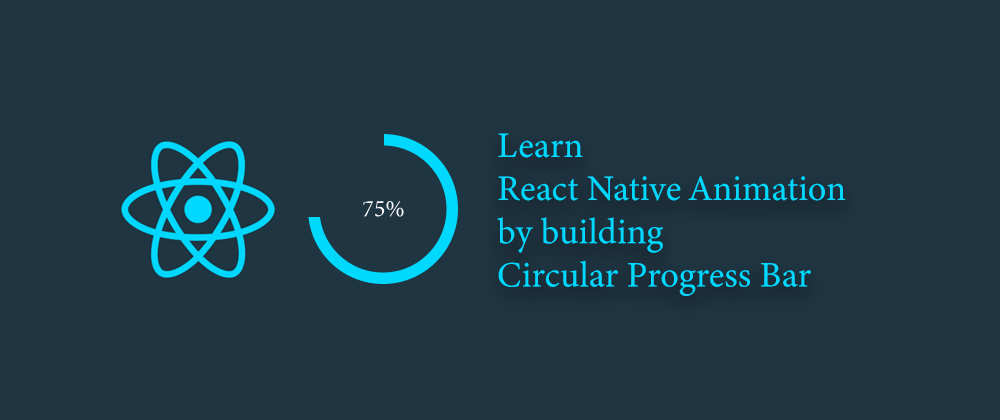  

Today, we are going to build a circular progress bar using `Animated` library of react native with the help of *three semicircles*. Let's understand the concept first then we will dive into coding.

# Concept
We have a base outer circle that serves as a container for the other three semicircles. We will rotate these semicircles with `transform` property to achieve the desired result.

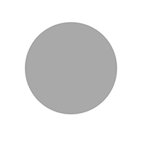

## How do three circles work?
Their working depends on the value of progress. It can either be less than or greater than 50. Let's see the two possible cases: 

## Case 1. If progress percentage < 50

### 1. First Circle
The first circle (purple) is initialized with a rotation of 180 degrees and completely covers the right portion of the outer base circle (grey).  

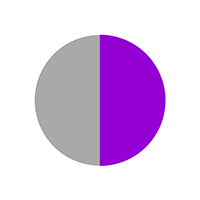

### 2. Second Circle
The second circle is rendered on top of the first circle (purple) with the same rotation and backgroundColor equal to the outer base circle (grey). It makes the first circle disappear as grey color completely overshadows the inner purple circle.  

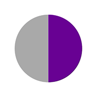   

> I have reduced the opacity of upper (grey) circle to show what's happening.

When the user clicks to animate, we are rotating the upper (grey) circle which is slowly revealing the inner (purple) circle from behind.  

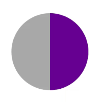  

> Note: Inner circle (purple) is not moving at all. We are rotating the upper circle (semi-transparent here) to show the inner circle from behind.  

### 3. Third Circle
The third semicircle is initialed with 0-degree rotation thus covers the left half of the base outer circle. Its background color is grey (same as the base circle).  
Remember, the second circle (grey on right) is moving clockwise and taking some of the left halves of the outer circle. It looks something like this:  

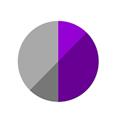  

Hence, the third (left grey) circle has a higher elevation which enables it to overlap the extra portion of the second circle on the left side.  

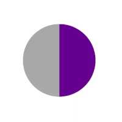


## Case 2. If progress percentage > 50
Initially, all three semicircles are initialed with 0-degree rotation and cover the left half of the outer base circle (grey). The first circle is at the bottom then second on top it and third on top of second as it has the highest elevation. This leaves the right half of the base circle empty.  

### 1. First Circle
Both first and second circles (both purple at left) will slowly rotate to cover the right half from 0 to 180 degrees together. This covers the animation to 50%.  

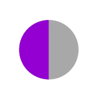  

Now first circle stops and second circle takes over to complete the remaining rotation.

### 2. Second circle
The first circle's job is to take up to 50% of progress and then the second circle will rotate some more to cover the remaining percentage.
I have made the second circle semi-transparent to show you how it's working. (the third circle is removed for simplicity). This is typically the case for `percent={70}`:  

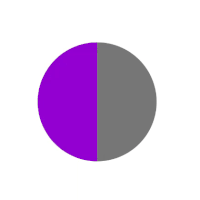

So 50% area covered by first circle and 20% area covered by the second circle adds up to complete the animation. But wait, what about the third circle? It is still on top of the second one and we can't see the second circle which is behind. Let's see what our third circle is doing.

## 3. Third circle.
We will rotate the third and second circle for the same degrees clockwise (extra 20% in current example). It will leave space so that the second circle becomes visible. To show clearly, the third circle is yellow right now and first & second are removed.  

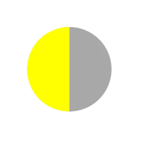   

**Do you see the problem here?** As our third circle rotates clockwise, it takes some portion of the right half and overlays the first circle *(third has higher elevation, remember?)*.   
The solution is simple and you might have guessed it already. Toggle the elevation value so the third circle goes inside the first circle.   
**First Circle** is semi-transparent right now so you can see how the third (yellow) circle is going behind the first one (semitransparent). After toggling elevation:  

  

I hope it is clear what's happening. Let's correct the colors and see our final animation!  

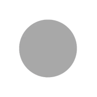

Looks good, isn't it? Let's add a smaller inner circle so our view can start looking more like a progress bar. 

## Inner circle
A smaller inner circle goes on top of everything creating an appearance of a progress bar.  

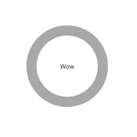

# Let's code

There are 5 steps involved:
1. Render base circle
2. Initialize default animation values
3. Render three semicircles
4. Add animation to semicircles.
5. Render inner circle

## Step 1: Render base circle
Render the base container circle with a grey color background. It is going to contain the other three semicircles.
```javascript
<View
  style={[
    styles.outerCircle,
    {
      height: radius * 2,
      width: radius * 2,
      borderRadius: radius,
      backgroundColor: passiveColor, //grey color
    },
  ]}
/>
```
## Step 2: Initialize default animation values
Initialize default values for all the three semicircles.

```js
//for first and second circle
const initialValueHalfCircle = percent >= 50 ? 0 : 180;

//for third circle
const initialValueInnerCircle = 0;

//initialize animated values to interpolate over degree of rotation
const firstCircleAnimatedValue = new Animated.Value(initialValueHalfCircle);
const secondCircleAnimatedValue = new Animated.Value(initialValueHalfCircle);
const thirdCircleAnimatedValue = new Animated.Value(initialValueInnerCircle);

//initialize time for rotation
const timePerDegree = duration / 360;

//first circle is always purple
const firstCircleColor = activeColor;

//for first case: second circle was overlapping with grey background when progress < 50 
//for second case: it was completing the animation after 50% with active purple color
const secondCircleColor = percent >= 50 ? activeColor : passiveColor;
```

## Step 3: Render three semicircles
We are going to render three semicircles, so let's write a helper function to make our job easier.
```javascript
const renderHalf = (color, transforms = [], otherStyles = {}) => (
    <Animated.View
      style={[
        styles.half,
        { backgroundColor: color, borderColor: color },
        { width: radius, height: radius * 2, borderRadius: radius },
        {
          transform: [
            { translateX: radius / 2 },
            ...transforms,
            { translateX: -radius / 2 },
            { scale: 1.004 },
          ],
        },
        otherStyles,
      ]}
    >
    //children
    </Animated.View>
  );
```
It takes a `color` prop and a `transform` prop to `rotate` the semicircles clockwise. Let's not worry about the logic right now and call this function to render our first semicircle.
```javascript
{renderHalf(firstCircleColor, [{ rotate: rotate1 }])}
```
> Note: `firstCircleColor` is activeColor (purple) in both cases.  

It's receiving `rotate1` value which is interpolation of animated value we initialised in previous step. It simply maps `1 integer value` to `1 degree`: 
```js
const rotate1 = animatedValue1.interpolate({
    inputRange: [0, 1],
    outputRange: ['0deg', '1deg'],
  });
```
Similarly for second circle:
```js
{renderHalf(secondCircleColor, [{ rotate: rotate2 }])}
```
> Note: `secondCircleColor` is passiveColor (grey) in first case (<50) and activeColor (purple) in second case (>50).  

Its rotation value can be interpolated with `secondCircleAnimatedValue` we initialized earlier.

```js
const rotate2 = secondCircleAnimatedValue.interpolate({
    inputRange: [0, 1],
    outputRange: ['0deg', '1deg'],
  });
```

Our third color is grey (passiveColor) in both the cases and receives a rotation value. Also, in second case (>50), we are toggling `elavation` value as described earlier. `renderHalf` for this use case can be:

```js
{renderHalf(passiveColor, [{ rotate: rotate3 }], {
  elevation: elevation3,
})}
```

`rotate3` and `elevation3` values can be interpolated as:

```js
const rotate3 = thirdCircleAnimatedValue.interpolate({
    inputRange: [0, 1],
    outputRange: ['0deg', '1deg'],
  });

  const elevation3 = thirdCircleAnimatedValue.interpolate({
    inputRange: [0, 1],
    outputRange: [0, -1],
  });
```
> `Elevation toggle logic:` the third circle is only rotating in the second case from left half to right half. As soon as it starts moving, it takes up some portion of the right half and that's exactly when we want to toggle elevation.


## Step 4: Add animation to semicircles.
Now we will write animation function for both cases. We want to start animating whenever we receive a new `percent` value. We can use a simple `useEffect` hook for this purpose: 

```js
useEffect(() => {
  if (percent < 50) {
    firstAnimation();  //first case (<50)
  } else {
    secondAnimation(); //second case (>50)
  }
  });
```
Above function simply chooses the animation to execute based on value of `percent`. Let's write our animation function for `first-case (<50)`: 
```js
const firstAnimation = () => {
  Animated.timing(secondCircleAnimatedValue, {
    toValue: 180 + (percent * 3.6),
    duration: (percent * 3.6) * timePerDegree,
    useNativeDriver: true,
    easing: Easing.linear,
  }).start();
};
```
`percent * 3.6` is just to convert percentage to degrees. This function will animate second circle (grey) in clockwise direction to reveal first circle (purple) from behind. Now, let's see animation for our `second-case (>50)`:

```js
const secondAnimation = () => {
    //resetting first circle to 0 degrees
    firstCircleAnimatedValue.setValue(initialValueHalfCircle);

    Animated.parallel([
      //first circle will rotate upto 180 degrees for 50% of progress
      Animated.timing(firstCircleAnimatedValue, {
        toValue: 180,
        duration: 180 * timePerDegree,
        useNativeDriver: true,
        easing: Easing.linear,
      }),
      //second circle is rotating along with first and some more to extra progress after 50%
      Animated.timing(secondCircleAnimatedValue, {
        toValue: 180 + (percent - 50) * 3.6,
        duration: (180 + (percent - 50) * 3.6) * timePerDegree,
        useNativeDriver: true,
        easing: Easing.linear,
      }),
      //third circle is moving along with second in clockwise direction for that extra value after 50% progress
      Animated.timing(thirdCircleAnimatedValue, {
        toValue: (percent - 50) * 3.6,
        delay: 180 * timePerDegree,
        duration: timePerDegree * ((percent - 50) * 3.6),
        useNativeDriver: true,
        easing: Easing.linear,
      }),
    ]).start();
  };
```

That's it, we are done with our animation. Let's add one inner circle to make this look like a progress bar.

## Step 5: Render inner circle
```js
//styles for inner circle
const innerCircleStyle = {
  backgroundColor: baseColor,
  width: 2 * radius - width,
  height: 2 * radius - width,
  borderRadius: radius,
  elevation: 1000,
  display: 'flex',
  justifyContent: 'center',
  alignItems: 'center',
};

//Complete view after adding the inner circle
return (
  <View style={styles.container} key={percent}>
    <View
      style={[
        styles.outerCircle,
        {
          height: radius * 2,
          width: radius * 2,
          borderRadius: radius,
          backgroundColor: passiveColor,
        },
      ]}
    >
      {renderHalf(firstCircleColor, [{ rotate: rotate1 }])}
      {renderHalf(secondCircleColor, [{ rotate: rotate2 }])}
      {renderHalf(passiveColor, [{ rotate: rotate3 }], {
        elevation: elevation3,
      })}
      <View style={innerCircleStyle}>
        {children}
      </View>
    </View>
  </View>
  );

```
And we are done! Click [here](https://github.com/iamshadmirza/react-native-design-system/blob/master/src/CircularProgressBar/CircularProgressBar.js) to view source code used in this tutorial.   
I hope you had fun learning animation with react native. Happy coding!
 
> This component was created by [Ankeet Maini](https://twitter.com/ankeetmaini). For full repo with TypeScript, head over to: https://github.com/ankeetmaini/rn-animation-circular-progress.
