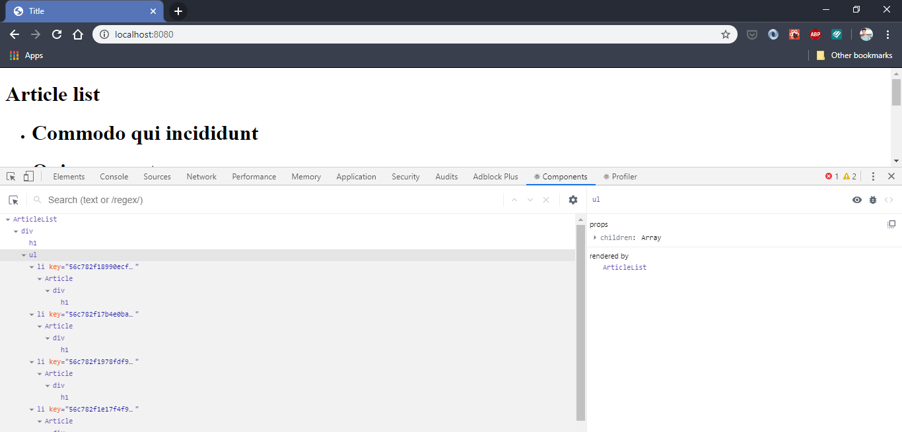

# React Devtools and Open-Source Components


React Developer Tools is a Browser Extension that allows you to inspect the React component hierarchy and provide a view of the component tree, the current state & props of each component. It makes debugging easy and developer's life simple. We will learn how to utilize DevTools in debugging React. Let's get started.

## Installing DevTools

DevTools extension can be installed either on Chrome or Firefox. You can visit the link below to install the extension.

* [DevTools for Firefox](https://addons.mozilla.org/en-US/firefox/addon/react-devtools/)
* [DevTools for Chrome](https://addons.mozilla.org/en-US/firefox/addon/react-devtools/)

If you can see the React logo next to the address bar then your setup is complete.

## Inspecting our App
Open React DevTools in your browser by right-clicking and selecting Inspect. "Components" and "Profiler" tabs will appear to the right which we will explore while debugging our app.

You can browse through the component tree and get a better understanding of the structure of your app. React elements can be selected to view extra information about that component like props, state, etc.



DevTools helps us understand how a component (example: ArticleList) is receiving data i.e. the complete downward data flow from root to children. We can manipulate the data a component is receiving in real-time and see how it changes the Virtual DOM. This is really powerful when it comes to debugging.  

React approaches building user interfaces differently by breaking them into components. It encourages us to re-use components wherever possible and more often than not we can find a component of our need from Open-Source. One such component is [`react-select`](https://github.com/JedWatson/react-select) which we are going to use in this tutorial. But before that, let's restructure our project: 

* Create a new folder `components` and move our component there. This folder will contain all the components.
* Change the imports to point to this directory. *(file names are in the comment above)*
```js
// app.js
import ArticleList from './components/ArticleList';

//ArticleList.js
import oneOpen from '../decorators/oneOpen';

// ArticleListOld.js
import oneOpen from '../mixins/oneOpen';

// ArticleOld.js
import toggleOpen from '../mixins/toggleOpen';
```
## Let's add `react-select`
1. Run this command to install the component:
```sh
npm install react-select
```

2. Import the component
```js
import Select from 'react-select';
```
3. Select component expects an `options` array props with objects having `label` and `value` keys. Look for the [documentation](https://github.com/JedWatson/react-select#props) when you're using a component from Open-Source for this information. We can create this options object as:

```js
const options = articles.map(article => ({
    label: article.title,
    value: article.id
  }));
```

4. Use it inside `ArticleList` component:

```js
import React, { Component }  from 'react';
import Article from './Article/index';
import oneOpen from '../decorators/oneOpen';
import Select from 'react-select';

@openOpen
class ArticleList extends Component {
  state = { 
    selectedArticles: null, 
  }
    
  handleSelectChange = (selectedArticles) => {
    console.log(selectedArticles);
    this.setState({ selectedArticles });
  }

  renderListItem = () => {
    const { articles, isItemOpen, toggleOpenItem } = this.props;
    return articles.map((article) => (
      <li key={article.id}>
        <Article
          article={article}
          isOpen={isItemOpen(article.id)}
          openArticle={toggleOpenItem(article.id)}
        />
      </li>
    ));
  };

//djsbjdbs
  render() {
    const { articles } = this.props;
    const options = articles.map((article) => ({
        label: article.title,
        value: article.id
    }));
    return (
      <div>
        <h1>Article list</h1>
        <Select
          options={options}
          isMulti={true}
          value={this.state.selectedArticles}
          onChange={this.handleSelectChange}
        />
        <ul>
          {this.renderListItem()}
        </ul>
      </div>
    );
  }
  //dshbds
}

export default ArticleList;
```

Here, we are describing the state of our 'Select' - null. Add value, Onchange. It means when we choose an item in 'Select', the object will be transmitted and shown in the console log in the handleSelectChange method.

## Conclusion
* Primary advice is to reuse code and components and focus on business logic. 
* We learned how to install and use React Devtools to view your component hierarchy and debug like a pro. 
* We learned how to use a third-party component and the wonderful world of Open-Source. We still have a lot of interesting things to do. Stay tuned!
