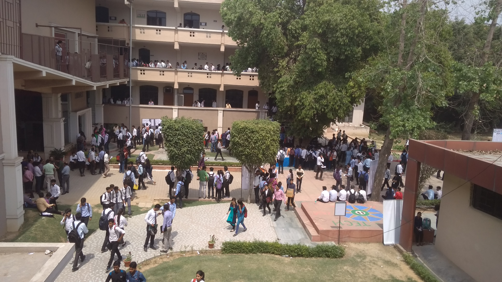

# From Nothing to Hashnode: My Tech Journey

Hi everyone, it's almost the end of the year 2020 and since everyone is sharing how this year went for them, I thought of doing the same. This is my coding journey from nothing to joining [Hashnode Team](https://hashnode.com/about). It's going to be a long ride so hold tight.

Let's start from the end of college life where the most common thought is **it's all over**. It wasn't over, this is where the story starts.

## College Ended, Now What?

I studied at a Tier 4 college in Lucknow, Uttar Pradesh, India. Like all other colleges in town, it did a poor job of education. I knew that it's not a very good college before joining but the tuition was really low and hopefully something which I can afford. 4 years of college went by passing exams without acquiring much knowledge about code. Till the time I had a degree in my hand, I only knew how to make a portfolio using JSP pages. But atleast I wasn't in a huge debt of education loan so that's good part.  

I was not good at coding at college because no one was answering my questions, **I got 30/100 marks in C and Java**. These were the only two subjects in our academic year for coding.

We didn't have placements at college so the usual way of getting a job was to go to Noida or Bangalore and apply at every mass recruitment happening. Mass recruitment is something like a Battle Royal where thousands of students apply for 100 seats in a service based company. Here is how it looks:

I did the same and went to few college nearby where the mass recruitment was happening. Waited in long queue with little knowledge of code wishing that someone will hire me.

This is me at one of the colleges for placements after **practicing how to print star pattern in C**. I knew the basics so cleared the coding round but failed at some later stage.

Now it was time to go to bigger cities like Noida or Bangalore. All of my friends were going and had asked me to tag along. **I didn't like that idea. Why?**

I asked one simple question to myself, **"Why should anyone hire me?"**

I didn't have an answer so I decided to prepare something to show before I go on a job hunt.

## Preparing for Job Hunt

My friends left for job hunt and I started thinking how and what to learn. I knew Java basics and JSP pages so I decided to get better at Java first then try Android Development.

It's June 2018 and Bucky Roberts is creating some amazing tutorials on YouTube. I learned Java from his [Java Core playlist](https://www.youtube.com/playlist?list=PLFE2CE09D83EE3E28) and moved on to learn Android Development from [these tutorials](https://www.youtube.com/playlist?list=PL6gx4Cwl9DGBsvRxJJOzG4r4k_zLKrnxl).

I didn't know about Udemy back then so YouTube was my savior. It took me three months to learn and get good enough to build a basic app with a firebase backend. Now it was time to fly to Bangalore but that didn't happen. Let me tell you how 😄

## How I Got My First Job

My college was situated in Lucknow city and there was an ongoing project of Lucknow Metro at that time. The government website sucked and I decided to make an app for the same.

The app had stations info, maps, and a fair calculator. It was also able to print the route back and forth on the screen. To make this basic app a little interesting, I stored the station data on firebase and added authentication. Once saved, the user can save a few routes for a quick view. That was all. The goal was to show that I know how to use firebase and build an app.

I was excited after building this since this was my first real project so I recorded a video and posted it on my WhatsApp status. Someone took that video and sent it to his friend in Bangalore and I got a call for interview. I came to Bangalore, gave the interview, and got the job 🎉. All thanks to [Bucky Roberts](https://twitter.com/bucky_roberts) Sir 🙏

My friends who came here 3 months ago are still searching for a job and will keep searching for 6 more months. If we look now, staying back was a good idea.

There is one little catch here, this is an early-stage startup with no funding so my salary was really low, I was hardly able to afford my living there. I have heard that startups don't really pay for 3 months (or at all) but that was a chance I was willing to take.

Since the pay was low and few of my friends were already placed in MNCs on much higher packages. Everyone I knew from friends to family suggested to not go for a startup and apply at MNC instead. My father said "Do what you feel is good for you" and that was quite relieving.

I thought the worst case could be I won't get paid for a year while keep working and I will have to start fresh next year with no proof of experience. I was 23 and losing one year was a risk that I can take. I was confident that as long as I know how to code, I can do something about my career even. I took my chances and joined this startup on October 22, 2018. The actual rollercoaster begins from here 🎢.

## The Startup Experience

It turned out that I was the only developer they hired to build the app because of the low budget. I was literally sitting alone on the chair in the entire hall. I didn't have the required android experience so my job mostly consists of research on how to implement things and then doing it on the same day. It was difficult but couldn't ask for a better situation to learn and grow fast.

The project continued for 2 months and the senior folks decided to abandon it and go with React Native instead. **But wait, I'm Java Developer, not JavaScript. I don't know a thing about JavaScript. 😧**

That's what I said. I was told to learn React Native in 2 weeks. I learned the basics of React Native in about 18 days and started the project. I didn't learn JavaScript first and kept learning what's necessary as things came in the React Native roadmap.

Things are pretty slow if you try to build an android app on a 4GB RAM laptop so it took some time for me to catch up. The company didn't have a system that I can work on so I had to use mine. And you know what happens when you use your own laptop for work? There are no work hour. You will have to work after work hour, at nights, on sundays too.

In the meantime, someone introduced me to Udemy and I took a React Native course by [Stephen Grider](https://www.twitter.com/ste_grider). I realized that I was doing almost everything wrong and since there was no one to check and guide, I kept doing it till I got this course. It was a life savior and Stephen is the best teacher I have seen in my whole life.

Startups are sure a great way to learn things quickly with a hands-on approach but it takes a toll on your mind and body. I was coding 12+ hours a day non-stop. No meetings, no standups, just get to work and start coding till the work hour ends. Then go back home and code some more.

The app was something like a cab, food, grocery, and medicine ordering in one place. This was way too complicated. The job was particularly difficult because I had no one to ask when I get stuck somewhere. It did help me develop problem-solving abilities but at a cost of a lot of stress. Not to forget the constant insults when a task was not completed on that unrealistic deadline.

I was popping headache pills every single day and used to take unpaid leaves just to sit back and relax so I don't lose my sanity. If you find yourself in a similar situation, leave as soon as possible.

I developed around 5 apps with backend in 1 year of working at this startup. I was growing at a rate where I was a totally different person every single month. We will talk some more about startups in a little while but now let's talk about some good things of Bangalore.

## Meetups: Wait, What's that?

During all this, I joined Twitter and got introduced to meetups happening in Bangalore. I went to a React Native Meetup organized by [GeekyAnts](https://twitter.com/geekyants/). It was a wonderful experience. While these meetups were totally free but it used to cost me 1000 INR. Since I don't have any leaves and I have to work 6 days a week at minimum. I had to give some excuse at work and attend the meetup. This will result in my salary deduction but it was worth it.

I got to know a lot of amazing folks from tech and instantly connected with them on Twitter. This opened my way to one thing that I was missing: Mentorship. Let me tell you how.

## Mentorship

While trial and error are still as effective as ever, having a proper mentor will help you reach your goals faster. But since I worked alone, I didn't have anyone to mentor me.

I decided to observe what others are doing and then follow the same. I was really fascinated by 3 people in our Indian tech industry who were doing some amazing job (I can't say the name). I turned on tweet notifications and started watching them. You won't believe how much information you can get from this single thing. As time passed, these people became my inspiration. I'm calling it **Indirect Mentorship** since the mentors have no idea that they are mentoring me 😂.

I learned that people love MobX, Design System, and more importantly blogging for some reason. So I tried all of it except blogging.

I was sure of one thing that I don't know anything. And blogging is about sharing your what you know so I hesitated at writing blogs. But then I asked one of the persons from above three about what to do when I don't have experience. I had lot of concerns like what If I make mistakes and I asked him on twitter. He wrote [this blog](https://sid.st/post/start-a-blog/) on May 17 2019 and it resolved all my concerns. After reading this, I wrote and posted [my first blog](https://iamshadmirza.com/how-to-align-and-justify-your-flex-item-in-first-try) on Hashnode on May 20, 2019. This was going to be a turning point in my career (again). 

> It's a rollercoaster remember? There are lots of turning points.

## The Blogging Journey

I started writing more. Whenever I learn something new, I will write about it to test my knowledge. I got better at writing and my article got selected among [Top 10 articles in Nodejs](https://medium.mybridge.co/node-js-top-10-articles-for-the-past-month-v-july-2019-2cca3caa76f6) among 1000 posts in June 2019. What better motivation could this be to keep going forward. 🙌🎉

After this, I went on to write for [gitconnected.com](https://gitconnected.com/), [alligator.io](https://alligator.io/), and a few other top publications.

This little achievement opened my way to many more opportunities and at the very right time. Let me tell you how.

## Freelance Journey

After a few weeks of this, the company stopped paying my salary because they ran out of funds. And the salary was low to begin with, so I didn't have any savings to afford a living.

Because of writing for these big publication, I got approached for writing tech articles and get paid for it.

My first earning from writing was $30 and it was a ghost blogging. If you don't know about ghost blogging, it's when you write and get paid but you won't get the credit. Few folks do this to create quality content on their portfolio to get more traffic and hopefully some freelancing gigs.

At this point in time, my posts were present in few top publications and I was getting noticed. People knew that I know React Native so people who happen to be on my blogs started approaching me for freelancing works. What a perfect timing!.

I did a few freelance projects to sustain the living but it was very difficult. Since I was spending around 10 am to 10 pm on office work, I barely had time to do anything else let alone blogging. I needed a solution.

I tried stretching the work at night but I was so tired that I couldn't do it. So I decided to wake up early.

I would wake up at 4 every morning and work on freelancing projects until 9 then head to my job at 10. Few mornings were dedicated to projects and few for blogging. This was more than enough to juggle office, freelance and blogging.

The only problem was, it was way too hard and the work culture was affecting my mental health. I wanted to leave this job as soon as possible and go back home.

## Quit the Job

The pressure was unbearable and hearing insults daily after working hard was not something I can keep doing. I decided to quit and printed a resignation letter to submit. Remember those 3 folks from the tech industry who were my indirect mentors. I approached one of them on Twitter and consulted about my problem. I said I can't do this anymore and I am going to quit, is this the right decision?

He stopped me from doing it and told me how difficult it was to find a job without any job. I had to keep working for a little longer until I get a better offer. Hence, I didn't submit my resignation.

## First Interview

I interviewed at a company in Bangalore. I told them I am self-taught so I might not be familiar with terminologies you use in the company but I can code. The interview experience was great but I didn't perform well. To be precise, I performed poorly and I hated myself for that. I got an offer for a fresher role but I didn't take it.

I decided to prepare and apply again in the next 6 months.

I already had a system in place which allowed me to stretch my day up to 4 hours. I stopped doing freelancing, blogging for a while, and dedicated my whole time to learning.

If this interview didn't happen at this time, I would have continued doing the same thing and never would have realized that I have to level up the game. This was an eye-opening experience for me which told me everything I had to improve to get a job in a good company.

## More on Mentorship: Introduction to Tanay

While all this was going on, I came to know about [Tanay Pratap](https://www.twitter.com/tanaypratap). I joined his telegram group called Team Tanay. Tanay works at Microsoft and has been teaching code to students on YouTube. More importantly, he genuinely cared about the student's future and gave really helpful advice. I instantly noticed that this is a great source of guidance.

I kept reading whatever he was sharing on Instagram or Telegram and took whatever I can. It was not a direct one to one interaction at this time. I was just observing him closely. For example, this picture was set as a group logo and I thought that this book must be good since he likes it so much to put on the group logo.

.jpeg)

I read this book **"So Good They Can't Ignore You"** and it was everything I was trying to do. He kept dropping helpful advice like build your portfolio, make projects, and build an online presence through blogging. I was already doing these without knowing the impact. I started adding more efforts to my projects/blogs to showcase on my profile. I was just trying to become good so I get hired in a good company.

A while after that, Tanay launched his first podcast ["Tea with Tanay"](https://anchor.fm/teawithtanay). He would invite people and talk about their experiences on a range of topics.

Again, this was also a super valuable source of guidance. I approached him directly to thank him for this and asked if there is any way I can help. That's how I started writing blogs on tea with Tanay. It was like supplementary reading for the listeners. It was wonderful collaborating with him.

That's how I got from having no mentor to having 4 amazing mentors. I remember how happy Tanay was when I got the job. He even came live on Instagram to share my success with his 40k followers too.

> If you know Tanay, you might be familiar with the team tanay job challenge. My encounter with Tanay was way before that happened. I would say that the job challenge is a consolidation of all the advices he was sharing in the group to get a job. If you're looking for a job, you should [check it out](https://2020.teamtanay.jobchallenge.dev/).

## My Breakthrough Project

My salary was still on and off at this time, I didn't know if I would be paid this month or not. So I had no choice but to look for some freelancing. Because of the blogs, I had people approaching for collaboration so I never had to actually search for a freelance project.

As I did more and more work on React Native, I found out that I had a lot of components already built which I was copy-pasting everywhere and tweaking them a little. I thoughts why not group them all and create a library flexible enough to work with any freelance project I get. I did exactly that.

I was interested in Design Systems so I read a lot about them and took the best of all the library to create a system for me. It was perfect for my needs and I was able to build UI way faster.

I open-sourced this project and published it to NPM as [React Native Design System](https://github.com/iamshadmirza/react-native-design-system). Building a library for general use-case and copy-pasting components are two different things. It wasn't easy but I gost to learn a lot about building and publishing a library.

I finally released React Native Design System on Feb 22, 2020.

%[https://twitter.com/iamshadmirza/status/1225340387906056193?s=20]

## Job Offers

I received a total of 5 offers (3 Bangalore startups & 2 overseas remotes) within a day of launching my library. I was surprised by the reaction it got from the community. It was almost like a dream 🤯.

All that hard work, waking up early when you don't feel like waking, writing when you don't feel like writing, coding when you don't feel like coding was going to pay off. To be honest, I was over the moon. It was magical and hard to believe. Let's talk about Hashnode now 🤩.

## Joining Hashnode

I have loved Hashnode even before I joined as a Full Stack Developer. Maybe that's what Sandeep noticed and approached me to join the team in Bangalore.

If you've read so far, you might have guessed that my life started changing since the point I wrote my first blog on Hashnode. It holds an important place in my career. I am really passionate about blogging and I encourage everyone to do it. In short, this is something that I believe every developer should do.

The satisfaction you get from contributing to something that you yourself believe in is priceless. I love contributing at Hashnode's growth and feel fortunate to work with this amazing team. On this note, I think the Hashnode team deserves a separate section.

## Working at Hashnode

Hashnode is fully remote so I get to work from my hometown, Varanasi. The team is supportive, approachable, and really fun. It hardly ever feels like work when you're having so much fun. When I joined Hashnode, I didn't have much experience on the web and still managed to work because I had people at my back supporting me. From PR reviews to testing, from pixel-perfect UI to elegant UX, I got to learn everything here. Hashnode groomed to reach where I am today. Let me introduce you to the team at Hashnode:

1. [Sandeep Panda](https://twitter.com/Sandeepg33k): CTO and a geek at heart. I would feel really proud if I can achieve his level of expertise. I learned how to ask better questions from Sandeep. Asking the right questions is half of solving the problem. Once you know what problems to solve, you can easily go ahead and break them into smaller chunks.
2. [Syed Fazle Rahman](https://twitter.com/fazlerocks): CEO and CSS Wizard at Hashnode. If you love Hashnode UI, all the credit goes to Fazle. I'm still learning how to build better UX from him and there is a lot to learn there. We ask him to sprinkle some pinch of magic when we build UI.
3. [Vamsi Rao](https://twitter.com/VamsiRao7): I and Vamsi joined almost together. He is really good when it comes to prototyping a new feature. He loves experimenting.
4. [Girish Patil](https://twitter.com/theevilhead): The oldest member of Hashnode, we call him Godly Girish sometimes. No matter how complicated a problem you throw at him, you can be sure that it will be solved. Problems are scared when they hear Girish is assigned to them.
5. [Edidiong Asikpo](https://twitter.com/Didicodes): The ever-energetic Didi is Developer Advocate at Hashnode. It's such a pleasure to work alongside her.
6. Shad: You know me already.

Although we are a team of 6 at the moment this section will be incomplete without mentioning [Bolaji](https://twitter.com/iambolajiayo). Bolaji was Developer Advocate when I joined and had been a part of the Hashnode team for a year. Always ready to help no matter when you ask.

That's all of us. We are expanding the team so you can [reach out](https://angel.co/company/hashnode/jobs) if you want to be a part of fun going on here.

## Tech Speaking

My breakthrough project was really a breakthrough for a lot of opportunities. Right after the launch, I got an opportunity to speak at [React Bangalore Meetup](https://twitter.com/ReactBangalore) about my library.

%[https://twitter.com/ReactBangalore/status/1225360307121356800?s=20]

I am an introvert and it scares me to bones whenever I hear that I have to speak. And speaking in front of 200 people was the scariest thing I can do. I said Yes anyways .

This was a fear that I wanted to get over with. [Kiran Abhuri](https://twitter.com/kiran_abburi) and [Aditya Agarwal](https://twitter.com/dev__adi) are two amazing people who are experienced in public speaking. I prepared a talk and presented it in front of them. Gathered feedback and improvised. Then finally presented at the meetup. (Sorry, I don't have a better picture)

Here is a little advice. Do the things that you are scared to do. Being scared is not a bad thing, it's just that it will be a little more difficult for you. But the fear will make you extra conscious and enable you to perform well. Our instincts are at their best when we are scared.

Sadly, the pandemic happened right after that, and I couldn't speak at more events. I have given [two more online talks](https://iamshadmirza.com/talks) up until now.

## Personal Note

I was working as a Full Stack Developer and recently got promoted to a senior role after working for 10 months. All I can say that this has been an amazing journey and it won't be possible if I didn't have the luck to meet so many people who helped me reach here. I was not able to mention few folks who played a very important role in holding me when I was down. It was never a win-win journey, you're going to see failure even though you tried your best. The idea is to keep going no matter what.

You might also feel like I got lucky and a hell lot of times. I feel that too. But what is luck? **Luck is being at the right place at the right time.** Try a lot of stuff, fail a lot, be at a lot of places and at a lot of times. Hopefully, luck will start to work for you too.

I started for real after my college ended. I know people who are doing great and not even joined a college yet. I know people who made it big at their 40s. We all have different journey. Stop comparing yourself with other people and embrace your life. You are unique and you should be proud of that.

I don't have a new year resolution yet. I'll try to keep doing what has worked for me so far. Excited to watch how 2021 is going to unravel 😁.

%[https://twitter.com/tanaypratap/status/1339147749044887552?s=20]

## Takeaways

There are a few very important lessons I learned that I am going to keep with myself throughout my life. I would like to share with you.

1. Hard work always pays off. Believe it and keep hustling.
2. You can make luck work for you by hardwork.
3. Don't undermine the effect of toxic work culture. Leave as soon as possible even at a cost of less pay. It might affect you for a long time even after leaving the place.
4. What goes in, comes back. Contribute to the community and the community will contribute to your success. Try to be helpful.
5. Difficult situation requires extra effort. Choose what you can sacrifice to get what you really want. For me, it was early morning sleep for 4 extra hours of learning.
6. Ask for help. The community is very welcoming and I'm sure it will help you. Reach out to me if you want. It's the least I can do to give back to the community.
7. Blogging is powerful. The best way to learn is by writing and you should definitely document your learning.
8. Try the scary stuff. It will help you outgrow your fear.
9. Make growth your number one priority. Always become better than what you were yesterday. Even 1% is enough.
10. Always ask for advice to the person who is already present where you want to be. Discard everything else. Your family loves you but they might not know what will work for you.
11. If you want to be noticed, become **So Good That They Can't Ignore You** 😉