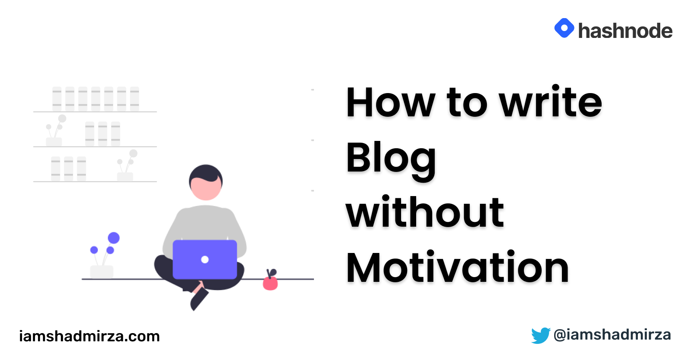
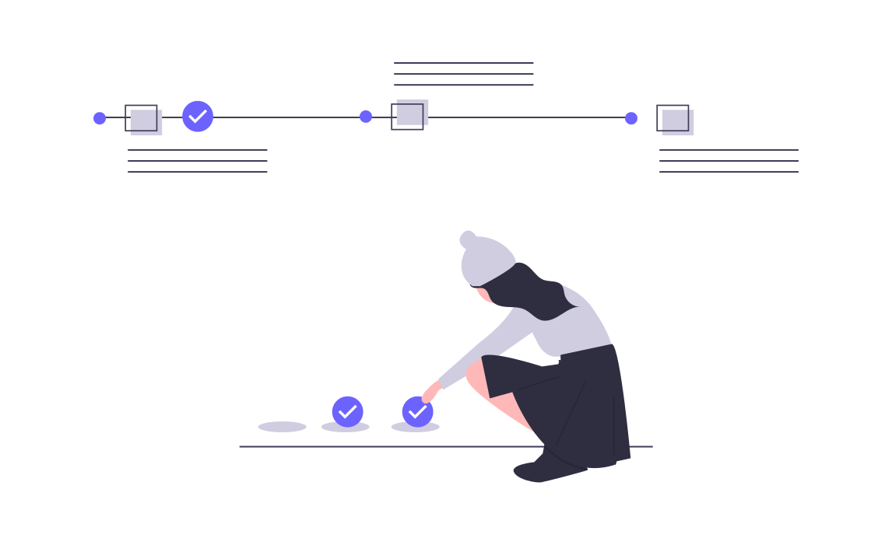

# How to write Blog without Motivation

Hey folks, I am going to share my approach to writing blogs with the least effort. Sometimes, I don't have much will power to write a lengthy blog and the thought of writing 2000 words just puts me into procrastination mode. This is what helps me make my approach a little easier. Let's start.

> This is not an opinionated blog. What works for me may not work for you. You gotta try for yourself and see if it fits.

The idea is to divide the whole flow into small chunks. Our brain usually tries to avoid hard work and this makes sure the work is not hard.

These are the required 5 mini-tasks that add up to complete the blog.

## Mini Task 1: Write a Description

You might not feel motivated enough to write the whole blog, but writing 5 lines of what you wanna write is comparably easy. The idea is to take a very small action irrespective of motivation. This tiny action will in turn motivate you to take more actions creating a cycle of motivation and action. This is something I learned from the book Atomic Habit by [James Clear](https://twitter.com/JamesClea). It's an amazing book, you should read it.

Write a short description of the blog which includes:

- Why you want to write about
- How it's going to help your reader
- What will be prerequisite that people must know to follow along and
- The takeaways from your blog.

It will help you pinpoint the intent and audience of your blog, the starting and ending point of your article. This is the scope of your article and it doesn't have to be lengthy. 4-5 lines work fine for me.

***Example:** I want to write about Animation in React Native. This will be for beginner and the reader should be familiar with useEffect hook. I will use Animated API to create a rotate animation and explain how Animated API and interpolation works in React Native.*

> I used the above description to write [this article](https://iamshadmirza.com/react-native-animation-using-hooks-loading-screen-cke5dggfc00zqshs1g4z3a0bg).

## Mini Task 2: Write Steps as Bullet Points

Your article most probably consists of steps that a reader will do if it's a coding tutorial. If not, there will different ideas that you want to share, they can consist of separate sections. These can also be key points that you want to mention in the blog.

We are going to write these steps/ideas/key-points as bullet points. You don't have to write anything inside the points yet. You just want a skeleton to fill in.

Example:

- Created a loading screen with an image and loading text at the center.
- Create `useRotation` hook to animate value and provide a relative degree of rotation.
- Imported that hook and use it to rotate the logo.

Now you have the skeleton that you can use as a guide to writing your blog. This makes writing a lot simpler.

> I used the above bullet points to write [this article](https://iamshadmirza.com/react-native-animation-using-hooks-loading-screen-cke5dggfc00zqshs1g4z3a0bg).

## Mini Task 3: Fill in the Skeleton

You have the skeleton now and you know what to write. Go ahead and fill in the details. Once you're done, you will have your first draft ready.

## Mini Task 4: Sleep on it

No matter how good you feel about your first draft. There will always be room for improvement, **that's why it's called the first draft.** Sleep on it and take a fresh look the next day. It will give a fresh perspective that will help you refine your blog.

Don't forget to add Takeaways at the end if it makes sense. Most of the readers look for that info.

## Mini Task 5: Check for Errors and Publish

It's finally the time to share your work with the world. But before that, make sure you have not done any punctuation errors or spelling mistakes.

You can use Grammarly to check for errors and make corrections.

Go to Hashnode and Publish your awesome blog.

## Helpful Tips

- Starting is toughest, make it as easy as possible. Writing 5 lines in the description is much easier than writing the whole article and it provides you the momentum to keep going. *Pushing a sliding car is much easier than pushing a car that is halted.* 😉

- Have an idea log, collect ideas to write on. Don't discard anything even if it's very basic. People might find that helpful which looks obvious to you.

- Decide to the date to publish in advance. It will help you realize the deadline and manage the time accordingly.

- Writing 30 minutes daily is better than dedicating 4-5 hours on the weekend. You think that you will have time and you can write it in one sitting but that might not happen in most cases.

- It's not mandatory to have lengthy articles. You can always post a short one. Feel free to write a TIL (Today I Learned) article, share your learning journey, and document more. Example 1, Example 2.

- Write what you're gonna explain first, explain that, tell the reader what you just explained. This flow is perfect for writing blogs that stick.

- Don't use lengthy sentences. Use small, simple sentences that are easy to read. Try to look helpful, not smart.

- Divide blog into small sections and guide your reader through it.

- Providing resources for further reading is very helpful. Do add appropriate links wherever possible.

## Helpful Links

- Some of the awesome content creators that you should follow [Monica Lent](https://twitter.com/monicalent), [Edidiong Asikpo](https://twitter.com/Didicodes), [Bolaji Ayodeji](https://twitter.com/iambolajiayo), [Aman Mittal](https://twitter.com/amanhimself), [Aditya Agarwal](https://twitter.com/dev__adi), [Catalin Pit](https://twitter.com/catalinmpit). You can learn more about effective blogging from them. They are the Pros.

- A curated list of [Awesome technical writing resource](https://github.com/BolajiAyodeji/awesome-technical-writing).

If you liked the article, you might wanna connect with on [twitter](https://www.twitter.com/iamshadmirza). Thanks for reading. Take and stay safe.  Shad.

*All graphics are courtesy of [unDraw](https://undraw.co)*
