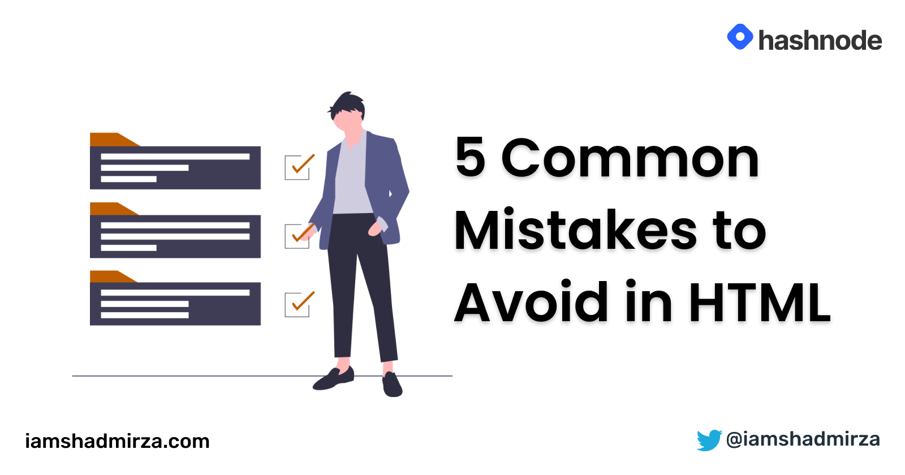

# 5 Common Mistakes to Avoid in HTML



Hello, amazing people. This article will cover few of the common mistakes that we often do while writing HTML. Let's get straight to it.

## 1. Use of Anchor Elements: `<a>`

Anchor elements are used to create a hyperlink to a file or a location of a webpage and should always be used for navigating to a real url. Anchor elements are often misused as fake buttons by setting their `href` to `#` to prevent the page from refreshing, then listening for their `click` events.

When we point `href` value to `#`, it breaks the default functionality of a link causing unexpected behavior when opening links in a new tab or window, bookmarking, copying/dragging links, or when JavaScript is loading, errors, or is disabled. They also convey
incorrect semantics to assistive technologies, like screen readers.

If something is supposed to be clickable, it should always be a `<button>`

Using here to add a link is not recommended as it doesn't tell anything about where it's going to navigate. Provide some proper text of where the links point to.

Example:

Read more about anchor tag [here](https://www.w3schools.com/tags/tag_a.asp) ❌

Read more about anchor tag on [w3school guide](https://www.w3schools.com/tags/tag_a.asp) ✅

## 2. Use of Break element: `<br>`

<br> element is used to break the text in an address or while writing poems specifically. Creating separate paragraphs of text using `<br>` is not only bad practice, but it is also problematic for people who navigate with the aid of screen reading technology. Screen readers can miss the content between two break elements while still announcing the presence of the tag. This can be frustrating for a person using a screen reader.

Use CSS `margin` property with `<p>` element to add space instead.

## 3. Use of Heading elements: `<h1>`

- HTML is a semantic language and anything regarding visuals should be done with CSS only. Avoid using heading tags to resize text. Instead, use the CSS `font-size` property. Headings use size to indicate their relative importance, but CSS is preferred for general-purpose resizing.
- Avoid skipping heading levels: always start from `<h1>`, next use `<h2>`, and so on.
- You should only use one `<h1>` per page.

This is wrong:

```html
<h1>Heading level 1</h1>
<h3>Heading level 3</h3>
<h4>Heading level 4</h4>
```

This is appropriate:

```html
<h1>Heading level 1</h1>
<h2>Heading level 2</h2>
<h3>Heading level 3</h3>
```

## 4. Use of Paragraph: `<p>`

Do not use empty `<p>` elements to add space between
paragraphs and it is problematic for people who navigate with screen-reading
technology. Screen readers may announce the paragraph's presence, but
not any content contained within it — because there is none.

Breaking up content into paragraphs helps make a page more
accessible. Screen-readers and other assistive technology provide
shortcuts to let their users skip to the next or previous paragraph,
letting them skim content like how white space lets visual users skip
around.

If extra space is desired, use CSS properties like `margin` to create the effect.

## 5. Use of Aside: `<aside>`

Aside represents content that is not directly connected with the main content. Example sidebars or call-out boxes. Do not use aside to tag the parenthesized test as that is part of the main content.

Writing semantically correct HTML is the responsibility of every developer. We often miss the HTML being overwhelmed by the era of the frameworks. I hope you learned something from this article. That's it for now. Take care and stay safe.  
[Shad](https://www.twitter.com/iamshadmirza)

## Resources

- [MDN Documentation](https://developer.mozilla.org/en-US/docs/Web/HTML)
- [W3School Documentation](https://www.w3schools.com/html/)