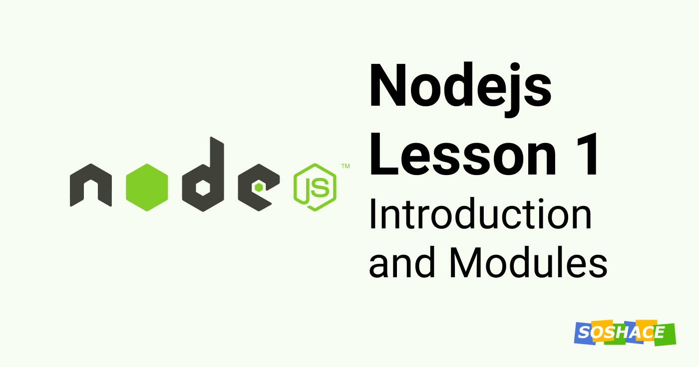

# Node js Lesson 1: Introduction and Modules



Hello everyone, this is the first lesson of the Nodejs course and we are going to cover the basics of Nodejs. We will also understand Modules in Nodejs and create one ourselves. Let's start.

## Nodejs: Introduction

JavaScript was meant for browsers but **Nodejs** allows us to run it on the server making our development much easier. Nodejs is JavaScript run-time environment. It means that we can create javascript standalone applications beyond the scope of the browser.

A user usually interacts with the frontend of an application and JavaScript is great with building interactive websites. But before Nodsjs, we need a server to interact with Database and provide requested data to the website. For this purpose, we were either using PHP or Java more commonly.

Nodejs helped us remove this barrier of language and allowed us to run JavaScript on the backend too. With Nodejs, developers don't need to learn two different languages to code frontend and backend of an application. If you know JavaScript, you can build both. That's one of the reasons for its remarkable adoption rate.

Nodejs is used to create server-side applications. It is built upon Chrome's V8 JavaScript engine which is why it's really fast. It helps us easily build fast and scalable applications.

Nodejs is non-blocking, it means that it can handle multiple requests at any moment. It doesn't wait for the data to return. Instead, it adds the requests to a queue and starts serving more requests while the previous one completes.

It is open-source and has around 1,372,861 packages contributed by the community at the time of writing this article. It means if you get stuck at any problem, there will probably be a package that can help you with that and you don't have to code the solution yourself. We can help from these tested packages and speed up our development by building our application on top of it.

We will follow this course by understanding different concepts in Nodejs and building an application. Let's start with understanding **Modules**.

## What are Modules in Nodejs

Modules help us bundle a set of functionality in a javascript library. In the Node.js module system, each file is treated as a separate module. We define functionality in the form of functions in a file and that file can be acquired using `require("Name of the module")` at any place. This allows us to reuse logic anywhere.

Nodejs has a set of default modules already available to provide some basic functionality. Some of them are:
The Node.js events module.
The Node.js fs module.
The Node.js http module.
The Node.js os module.
The Node.js path module.

For example:  
**http** module allows Node.js to transfer data over the Hyper Text Transfer Protocol (HTTP).  
**fs** stands for file system module and it allows us to work with the file system on our computer.

We can also install any module from the gigantic library from the Node Package Manager (npm). Remember the 1,372,861 packages we talked about earlier? Those can be easily imported and used with the help of **npm**.

## How to Create a Module

Let us create our first project with Nodejs. Our aim will be to get familiar with the concept of Modules and the Nodejs way of organizing our project. But before that, we need to have Nodejs set up on our machine.

### Install Nodejs

To install Node on your computer, go to [https://nodejs.org](https://nodejs.org) and download the latest LTS version available. After installation is complete, go to terminal or command prompt and type `node --version` and make sure you can see the correct version you installed.  
If you see an error "command not found", you will have to set up the PATH variable on macOS and Environment variable on Windows to locate node installed directory.

When we install Node on our install, it also installs a command-line tool **npm** which stands for ‘Node Package Manager’. We will use this tool to initialize the project.

### Initialize directory

Now we have installed Nodejs and we are ready to create our first project. Create a directory and navigate to it via terminal.  
Type `npm init`, this will initialize the directory as a Nodejs project. Once the initialization is complete, you will see a `package.json` file created. Nodejs uses this file to track packages installed into your project.

### Create entry file

We are going to create an entry file for our project. Go ahead, create a file named `index.js` and add the code below:

```js
function User(name){
this.name = name;
}

User.prototype.hello = function(who){
console.log("Hello, " + who.name);
};

var tim = new User("Tim");
var tom = new User("Tom");

tim.hello(tom)
```

Add a User object, which will create users then add a function `hello`. We will use this method to print out the name of the user with a greeting.
Run it via console/terminal:

```sh
node server.js
```

If you can see the result on your terminal, it works. 👏🏼

It's a simple file but imagine if we want to use this functionality at multiple places. In that case, we can encapsulate this functionality into a module and export it. Let me show you how.

Create a new folder `user` and add a file `index.js` with this code.

```js
function User(name){
this.name = name;
}

User.prototype.hello = function(who){
console.log("Hello, " + who.name);
};

console.log('user is required'); // to see when our module is required.
exports.User = User;
```

Now, require this module in `index.js` in root directory like this:

```js
const user = require('./user');

var tim = new user.User('Tim');
var tom = new user.User('Tom');
tim.hello(tom);
/**
 * console log:
 * user is required
 * Hello, Tom
 */
```

You have just created your first module.

## Create a JSON file to store names

Let us create our own JSON file that will keep information on our phrase in the console.log of a User. You will need to:
Create a JSON file named `en.json` inside the `user` directory and add this:

```json
{
 "Hello": "Hi"
}
```

Then use it inside `/user/index.js`

```js
var phrases=require('./en');

function User(name){
 this.name = name;
}

User.prototype.hello = function(who){
 console.log(phrases.who + ", " + who.name);
};

console.log("user is required!");

exports.User=User;
```

Directories can also be connected. In this case, Node.js searches files with this name, then it searches a file named user/en.json, and if it doesn’t find anything of these, it starts searching for a directory named user and there it will look for a file named index.* considering it a module.

You can download the lesson’s code from the repository