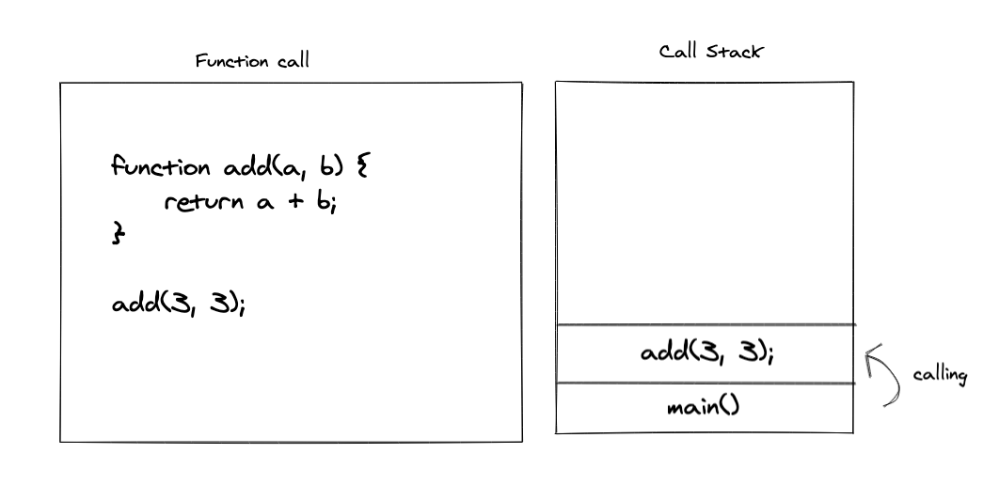
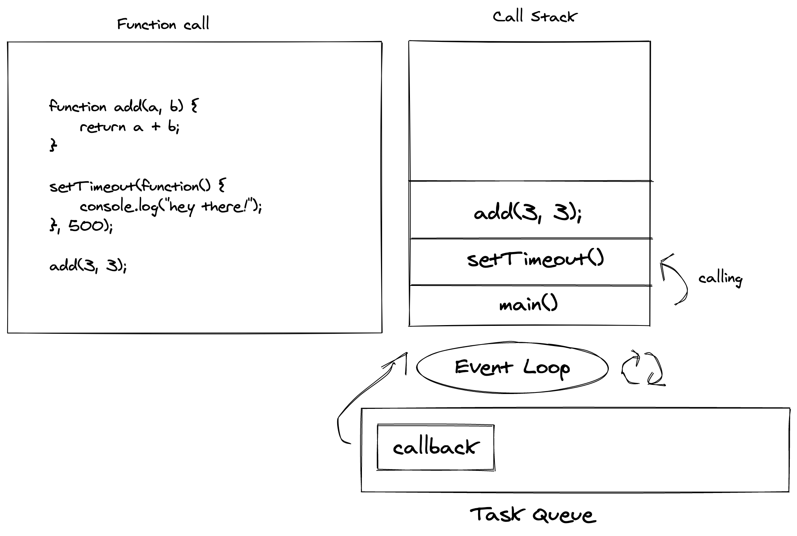

# Nodejs Lesson 16: Internals of Nodejs: Event Loop

Hey everyone, this lesson will continue the last lesson where we learned how the LibUV library works internally. In this lesson, we will learn about Event Loop and understand various terms like call stack, callback queue, etc. Let's start.

## What is Call Stack

JavaScript is a single-threaded language, which means it can do one thing at a time. This also means that it has a single Call Stack. Now, what is a Call Stack?

A call stack is a data structure that holds information about what line of the function is currently being executed. A call stack is used to keep method calls, and it follows the LIFO (Last In First Out) data structure. By LIFO, we mean a container where the last item entered will be the first to get out. There is only one entry from the top, and if you want to take the item at the end, you will have to take everything on top first. If you're thinking about a box of Pringles, then you're absolutely correct.

Let's understand how this call stack holds method calls:



1. We call the `main()` function, it gets pushed into the call stack. 
2. This will call the `add()` function and push it to call stack. 
3. Once it hit `return,` `add()` will be popped out from the call stack.
4. Finally, the `main()` will be popped out. 

This will leave the call stack empty, just like how it was at the beginning. I hope things are clear until now.

Think about what will happen if one of the expressions takes a long time to run? Something like a very long `for` loop. Call stack can only accept new expression once the current one has finished running. And since the for loop is still running, javascript can no longer accept new expressions.

The thread will be busy, and it will no longer execute further, leaving the browser stuck. This is what happens when we run a very large loop and try to do other tasks in the meantime. It is not ideal when we think about user behavior. A user using your website will probably try to click on some links or probably hover over a link to get more info. They would like to do other stuff when javascript is waiting for a long operation to finish. How to solve this problem? That's where callbacks come into the picture.

## What is a Callback

A callback is just a function call that runs after an asynchronous time taking expression has finished running. With the help of callbacks, javascript doesn't have to keep watching if the expression is running or not. It will trust the callback to inform when it's the execution is finished. With the callbacks keeping a check on an asynchronous call, JavaScript can perform other tasks in the meantime. It's like the callback is telling JavaScript that "Hey, the expression has run. Can you please take care of me now?"

You may have already used callbacks before in the `setTimeout` function. The first argument takes a function, and the second argument takes a number denoting the time in milliseconds. The function passed in the first arguments will be called only after a certain amount of time. We will refer to such a type of function as callbacks.

```js
setTimeout(function(){
    console.log("hey there!");
}, 500);
```
In the above code, the text "hey there" will be logged after 500 milliseconds.

Do you remember where else we were using callbacks all this time? `server.listen()` and `http.createServer()` functions were taking a function as callbacks. So it turns out that you were already familiar with this term.

Now the real question, we said that javascript could handle one thing at a time, then how does it can handle callbacks while doing other tasks at the same time? This is where Event Loop comes into play.

## What is Event Loop

Let's add one more expression to our `add()` example above.



As you can see, we have introduced two more items in the image above. **Event Loop** and **Task Queue**

Let's see what happens when this piece of code runs.

1. It will push the `main()` function into the call stack.
2. Then it will push `setTimeout()` into the call stack.
3. `setTimeout` is asynchronous. It will be popped from the call stack and pushed into the task queue. Task queue will hold all the callbacks to be called later.
4. `add()` function is encountered and pushed to call stack.
5. Nothing is left to process, so `add()` will return and get popped from the call stack.
6. Now, only `main()` is left is a stack that will be popped out of the stack.
7. Event Loop will see that the call stack is empty and there is one pending callback in the task queue. It the push the callback, which is just a function into the stack, and prints the log.
8. Once the log is printed, it will be popped, and our function will finish running.

Task Queue is just a callback queue that holds the callbacks until they are executed. Remember, it will only run when the call stack is empty. Event Loop ties the call stack and callback queue together. It will check when the call stack is empty and pushes the remaining callbacks into the stack. That how you can do other stuff like clicking when the fetch call is in process.

The Event Loop is provided by the LibUV that we talked earlier and it's an essential concept that makes Nodejs so much efficient. Without the concept of Event Loop, Nodejs won't be able to server so many requests concurrently. Now that you have a clear understanding how the whole Nodejs works internally, I hope you will be able to better explain it to the others and write better code in general.

I hope you understand how Event Loop runs and how callbacks help JavaScript run any asynchronous calls. That's it for now, we will see you in next lesson.
