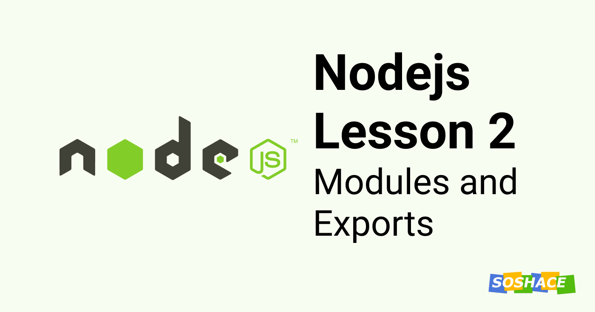

# Node Lesson 2: Modules and Exports



Hey everyone, we learned what are modules and how to create one in previous. This lesson will dive deeper with the module, understand what properties it carries, and then talk about export in detail. Let's start.

## Properties of Module

Every javascript file in the Nodejs project is a separate module and it contains a global **module** object. Let's try to log in and see what's inside. Go to **index.js** and add this code:

```js
console.log(module);
```

This will log the information about the module. Let us understand it's properties briefly:

- **filename** – full name of the file
- **id** – generally contains a detailed path to the file. If an operation/file system supports symbol links, it means all symbol links will be drawn.
- **exports** – all information that goes externally. We talked about it at our last lesson.
- **parent** – a link to a parent module, i.e. the module that required this one.
- **loaded** – shows whether a module has been uploaded. When the module gets moved to a console, it hasn’t been processed yet.
- **children** – the modules that were connected by this module via require.
- **path** – a sort of an inner ID.

Using these properties, the module keeps track of itself. These all properties have their relevant importance but right now we are interested in two parameters: `parent` and `exports`. Let us talk about these.

## Parent Property and How to use it

A file in Nodejs can be run directly by calling `node filename.js` or it can just work as a module that exports a certain function to another.

We can use `module.parent` to check in which mode our file is running. `module.parent === true` means that a parent is calling this file using `require('./filename.js)` and if it is `false` then it is ran directly by `node filename.js`

Using this check, we can tell the program to do two different things depending on how the code is executed. In the example below, we will export the function `run()` if it is working as a module and being called in a parent file. Otherwise, we will simply run the function.

```js
var user = require('./user');  
  
function run() {  
    var tim = new user.User("Tim");  
    var tom = new user.User("Tom");  
  
    tim.hello(tom);  
}  
  
if (module.parent) {
    // used with require(./user);
    exports.run = run;  
} else {
    // ran with node user.js
    run();  
}
```

If there isn't a parent module, we can run this file independently using this feature. Now let's talk about `export`.

## Export and How to use it

When you're building a Nodejs application, you will have to create a lot of modules that will become building blocks of your application. You need to understand how to export them and use them wherever required.

**module.exports** is an object that the current module returns when it is **"required"** in another program or module. Whenever we want something like values or functions to be available for another module to import and use, we attach that value or function with this **module.export**

Example:

Export few properties from one module:

```js
// ./moduleOne.js
const firstName = "Shad";
const lastName = "Mirza";

function getFullName (){
    return firstName + lastName;
}

module.exports.firstName = firstName;
module.exports.lastName = lastName;
module.exports.getFullName = getFullName;
```

Require and use it in another module:

```js
// ./moduleTwo.js
const name = require('./moduleOne');

console.log(name.firstName);
console.log(name.lastName);
console.log(name.getFullName);
```

We can use variables and methods of one module into another in a similar fashion.

We can also use **exports** instead of **module.exports** and acheive the same functionality. You can consider this as shorthand of the longer method. Example, this will totally work fine:

```js
// ./moduleOne.js
const firstName = "Shad";
const lastName = "Mirza";

function getFullName (){
    return firstName + lastName;
}

exports.firstName = firstName;
exports.lastName = lastName;
exports.getFullName = getFullName;
```

Whereas, if you assign the properties directly to **exports**, it won't's work:

```js
exports = firstName;
```

This happens because **exports are an object** and we **assign properties** to it. These properties then get exported to another module. By assigning directly to **exports** itself, we reinitialized that property which will break the desired functionality.

**exports** can be considered as alias of **module.exports** to write less code. Imagine it as something like this:

```js
exports = module.exports = {}
```

> Please note that we are actually returning **module.exports** not **exports**.

Our next stage will be to add a database to the project.

## Connect to Database

Let's create a **db** directory and move our JSON file into it. Add a file **index.js** which will be a helper module to connect with db (en.json) and get phrases from the JSON file.

```js
// ./db/index.js

var phrases;
exports.connect = function() {
    phrases = require('./en');
};

exports.getPhrase = function(name) {
    if (!phrases[name]) {
        throw new Error("There is no such a phrase: " + name);
    }
    return phrases[name];
};
```

We just created a **db** module that has a **connect** method to connect with the database and **getPhrase** method to fetch data. This method will return a respective phrase, but if not – it will show an error.

Now, let's use this module in **user/index.js**.

```js
var db = require('./db');

function User(name){
    this.name = name;
}

User.prototype.hello = function(who){
    console.log(db.getPhrase("Hello") + ", " + who.name);
};

console.log("user is required!");

module.exports = User;
```

We just replaced requiring **en.json** with **db.js** and then logging phrase using **db.getPhrase** method.

This won't work unless we connect with database first. Go to **index.js**:

```js
var db = require('../db');
db.connect();

var User = require('./user');

function run() {
    var tom = new User("Tom");
    var tim = new User("Tim");

    tom.hello(tim);

    console.log(db.getPhrase("Run successful"));
}

if (module.parent) {
    exports.run = run;
} else {
    run();
}
```

The first time a module is executed, it gets initialized. This is when we call **connect()** to connect to the database *(JSON file in our case)*. After that, we can use anything from the database as we want.

We are using **index.js** to connect to our database. This looks like a task of a server. Let's move the whole logic inside a file **server.js** and then import it in the index as follows:

```js
var server = require('./server');

server.run();
```

We have successfully connected with the database using Module ✨. Now, let's talk about how modules are searched and what it has to do with Module Caching.

## Module Caching

All the modules get instantiated with some null properties when required. Our connect function is instantiating  **phrases** with **en.json** instead of null.

What do you think will happen if we require **db** again?

You might think it will initialize the object again but that is not what happens. Requiring the same module in a different location doesn't create different instances but use the one that was initialized the first time. This is what we call **Module Caching**.  

The module gets cached during the first require statement, meaning only one instance of that object is created — subsequent require statements in other modules just enable us to access that same object.

It means that the changes with **db object** will persist upon us trying to import **db** inside **server** and then in **user** module. We are using same **db** object in both **server.js** and then in **user/index.js**

## What we learned

In this lesson, we learned

- About the properties of the Module object
- What is **Parent** property and how to use it
- What is Exports
- How to export functionalities and use it in another module
- How to connect to the database (JSON file)
- What is Module Caching

That's it for now, we will talk more about modules as we progress with the development. Our next lesson will be about the Node Package Manager (NPM).

Check out the source code of this lesson in this [GitHub repo](https://github.com/soshace/node_js_lessons/tree/lesson_2).
