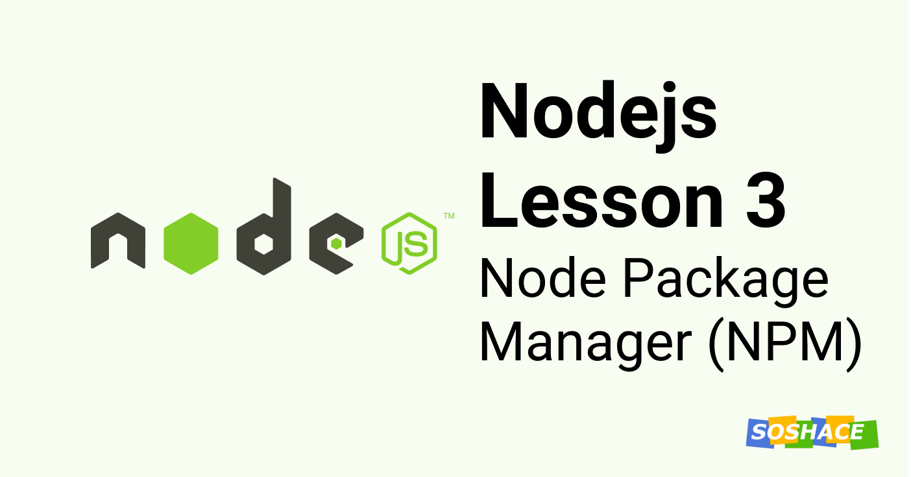

# Node lesson 3: NPM



Hello everyone, we are going to learn about Node Package Manager (NPM) in this lesson. We talked slightly about it in [Lesson 1](https://blog.soshace.com/1-lessons-nodejs-modules/) and initialized the project. Let's dive deep now.

## What is NPM

As the name suggests, it's a Package Manager for Node. Open Source Developers from all around the globe can publish their Node packages and use the packages published by other people for free.

It is an online repository for the publishing of open-source Nodejs projects.

It is also a command-line utility to interact with packages in a Nodejs project and manage dependencies. The dependencies are just the packages that are being used in the project. **npm cli** helps are easily install and remove the packages available on the npm registry.

It helps us rapidly build software with the help of the 1,372k+ packages present on the npm registry. If you're stuck with a problem, chances are there is already a solution contributed by someone which you can directly.

NPM comes with standard Node installation. We already have a cli to interact with npm packages. You can check by running `npm --version` in the terminal. Now let's understand how it works and how can we create a package ourselves.

## How to create a module and share it with community

Suppose you have created a package and you want to share it on npm as a package. To keep things basic, let's consider this is your awesome package:

```js
// index.js
module.exports = function(){
    console.log("My awesome module at so share");
}
```

To share this package on NPM, you will have to initialize the repository as an npm package. To do that, you simply have to run one command:

```sh
npm init
```

The cli will ask you a bunch of questions regarding package name, version, author, etc and generate a **package.json** file. It is the same file that is used to track the package version too.

```json
{
  "name": "supermodule",
  "version": "1.0.0",
  "description": "ERROR: No README data found!",
  "main": "index.js",
  "scripts": {
    "test": "echo \"Error: no test specified\" && exit 1"
  },
  "author": "Your name here",
  "license": "ISC",
  "repository": ""
}
```

Now we are ready to publish your awesome package.

> We are naming our package "supermodule"

## How to Publish

You will need an npm account to publish your package. If you don't have already, visit the [signup page](https://www.npmjs.com/signup) and create an account.

Once you're done, open terminal and login with your account using:

```sh
npm login
```

You'll have to enter your username, email, and password to login successfully. Finally, enter this command to publish your package:

```sh
npm publish
```

> Make sure your package name is unique.

Congratulations, you have published your first package 🎉. You can type `npm help` to list down all the npm commands.

## How to install a node package

Now we will talk about how someone can install and use your package in their project. The person simply has to type `npm install` followed by the package name he wants. For our example, it will be:

```sh
npm install supermodule
```

NPM will download the package and save it inside the `npm_modules` directory. This directory is the default place to save all the installed packages in a project.

Now the developer doesn't have to type the full path to the module. NPM checks if the package is present in `node_modules` folder and easily imports it into the file:

```js
import SuperModule = require('supermodule');
```

Good job, you have helped someone solve their problem using your awesome package. This is how Open Source Community helps each other and by publishing your package, you have become a part of it 🎉.

What if the package is no longer needed and you want to uninstall it? You just to type this command in terminal and it will remove your package:

```sh
npm remove "PACKAGE NAME"
```

> Enter the PACKAGE NAME that you want to remove.

You can see the meta of the published package by visiting this url: 

[http://registry.npmjs.org/supermodule](http://registry.npmjs.org/supermodule)

Here, you can see all information on the module and its package.json including a link to the module file is contained.
This file is also in the database. It was downloaded there automatically in a process of the npm publish command. Note that everything contained in this registry has public access.

NPM does offer you to publish packages with limited access if you want to limit the usage. It is however paid and you can read more about the pricing on their [official page](https://www.npmjs.com/products).

That's it for today's lesson. We will continue more in Lesson 4. 