# How I set up Notion for Productive Sanity

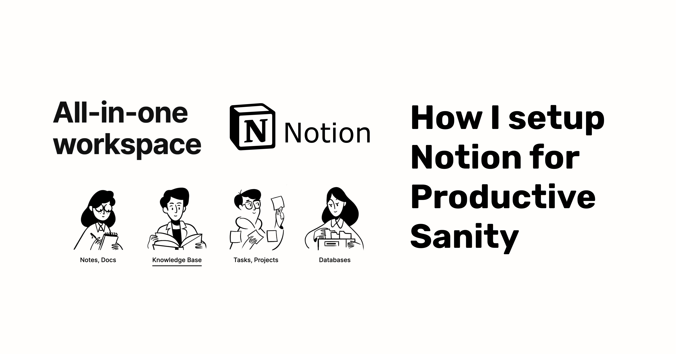

## Introduction

Hey everyone, today I'm going to give a walkthrough of how I set up my Notion workspace and organize my ideas. It will be a step-by-step guide and I hope this helps you. Let's start with a question.

## What do you want?

I would suggest you sit down, take a pen & paper and write exactly what you need. These will be the things that you want to organize. There are tons of customization possible with the Notion and it's one of the reasons that makes it so overwhelming. Having a list of requirements will help you narrow down the structure. Always remember, **If something works for you, it's the right thing.**

## Overview

Our Notion workspace will have a homepage that serves as a roadmap for all the pages inside. It will contain sections of different schemes which will consist of one or more pages each. So, this is what we are gonna organize:

1. Home Page
2. Ideas Section
3. Productivity Section
4. Project Section
5. Learning Path Section
6. Using Relations in Databases

These sections will vary upon your needs so you don't have to add everything I'm listing here. Let's start with Home Page.

## Home Page Setup

This is pretty straight forward. We are just laying the ground for all of our important stuff. Follow the steps below:

1. Create a new workspace
2. Start without a template.
3. Delete everything on the page
4. Rename your page as per your preference, add a nice icon and a background. It will look something like this now.

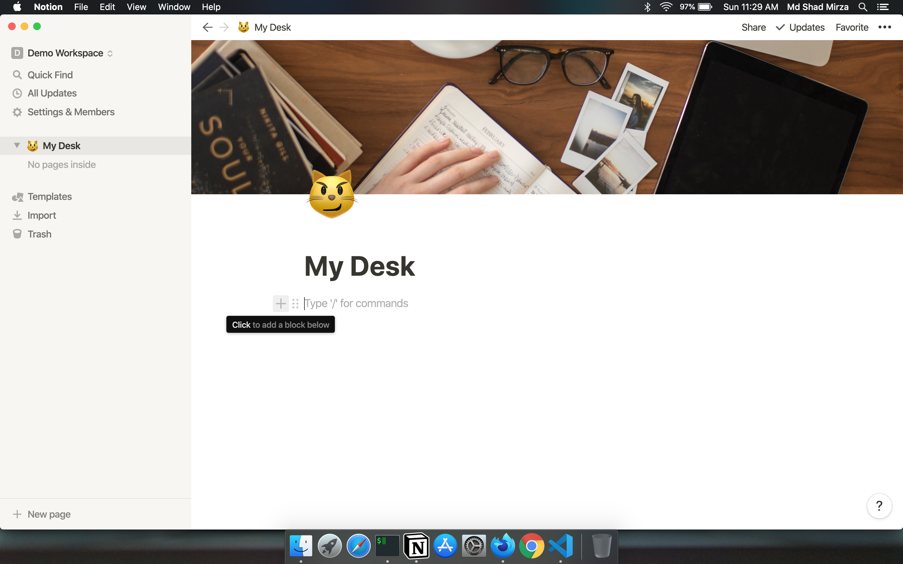

>This is going to be the container for everything we want to add.

## Ideas Section Setup

1. Press the **"+"** button. Select **Heading 2** from the options that appear. We are going to divide our Home Page into small sections.

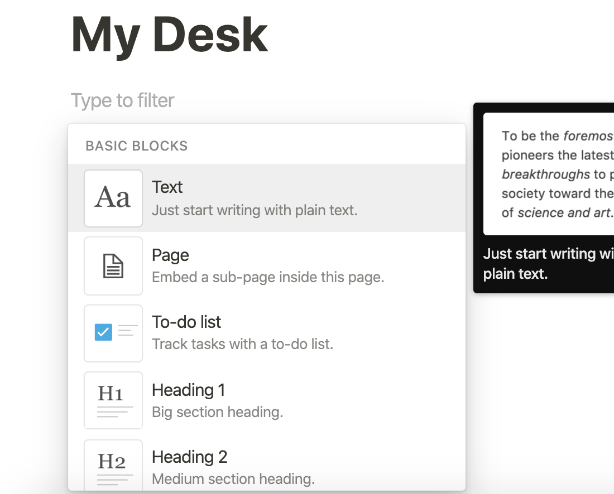

2. After adding a heading, go to the next line and **add a page.**

3. I arrange my ideas on a Kanban board and move them to different stages as I progress. Go ahead, select **Board** from **Database** section. Here is the outcome:

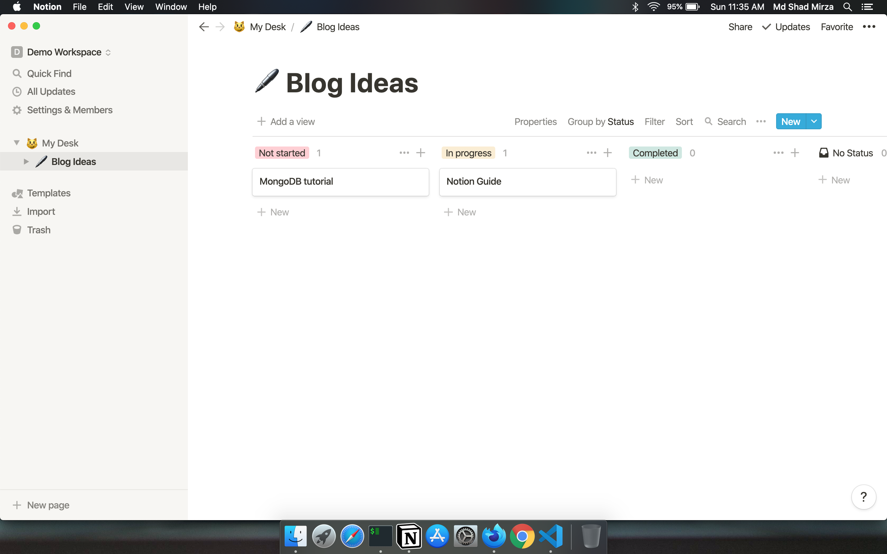

> Tip: Add icon and cover to make things pretty. I have moved **No status view** to end. I'll add items in **Not started** section and move those cards to **Completed** as I proceed.

4. I'll do the same thing for Talk ideas, Drawing ideas, and Generic ideas. Time for a trick: **Create Duplicate is your friend.**

5. Click on the right-most three dots on your page and select **Duplicate**.

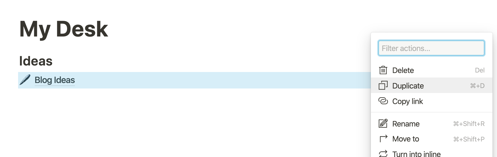

This will create an exactly similar page. When the page is created, edit title, icon, cover, and remove the irrelevant cards and you are done. Repeat this for all the ideas you want to manage, here is the outcome:

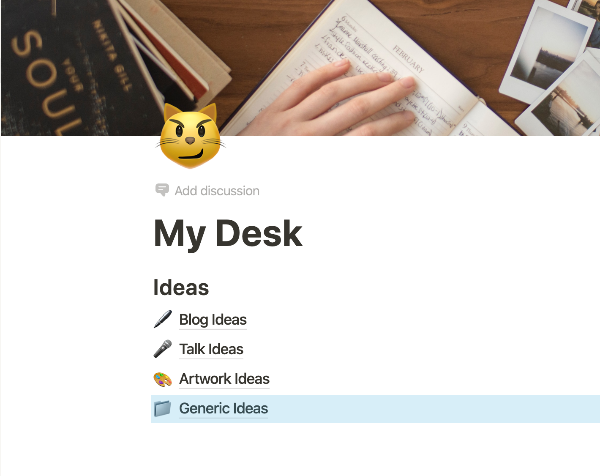

Let's move on to the next section.

## Productivity Section Setup

Go to the next line, add H2 heading **Productivity** and rearrange the position according to your choice 

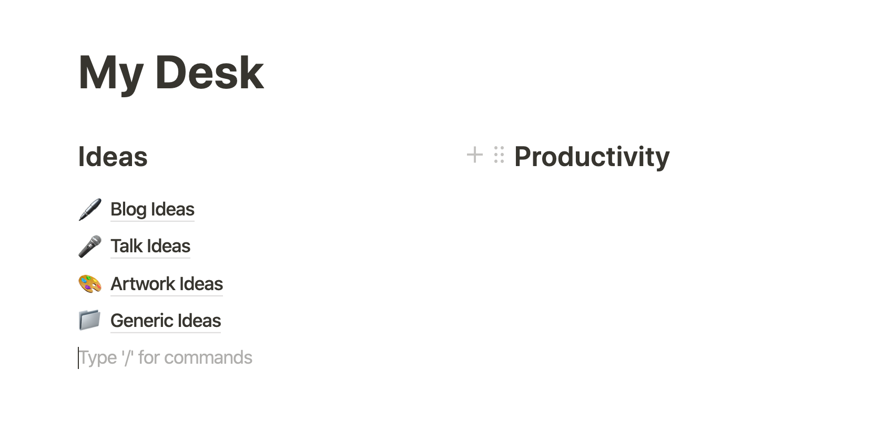

My productivity section has 2 pages
1. Daily Tasks
2. Habit Tracker

### 1. Daily Tasks

1. Add a new page in the productivity section.
2. Select **Calendar** from **Database** and add the title, icon, and cover. It will look something like this:

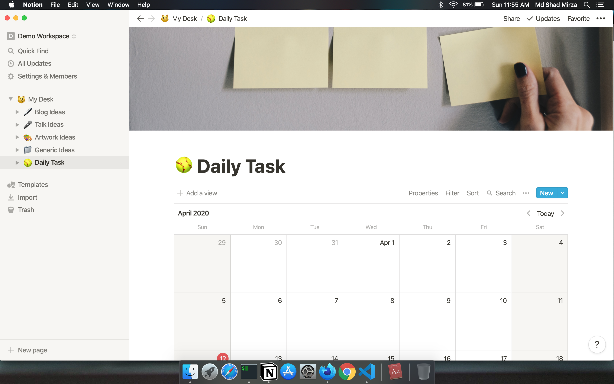

4. Click on **"New"** and select **"+ New template"**. This will create a template that we can use each time we add a task to a new day.  

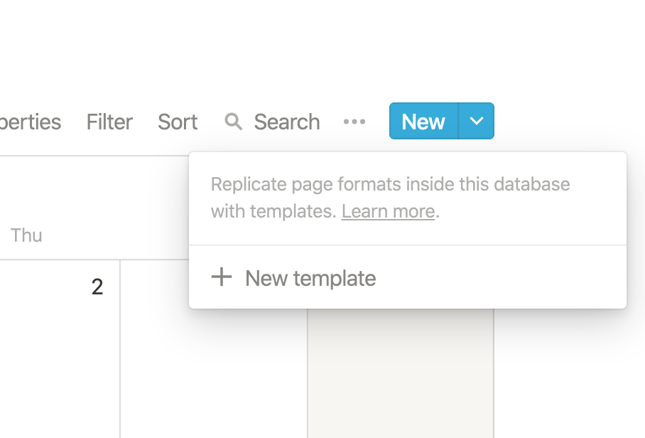

I've created my template something like this, you can customize based on your preference.

Go back and click on "New" when you're done creating the template. You will see your template below. It will auto-populate everything for you which you can edit.

### 2. Habit tracker

1. Add a new page in the productivity section.
2. Click on the **Template** and browse the template gallery. You will find a Habit Tracker template which you can import by clicking **Duplicate**.

> Here is the [link](https://www.notion.so/Habit-Tracker-aba86e2b65fd46b89808194784d50484) to the template I'm using.

Our desk progress so far:
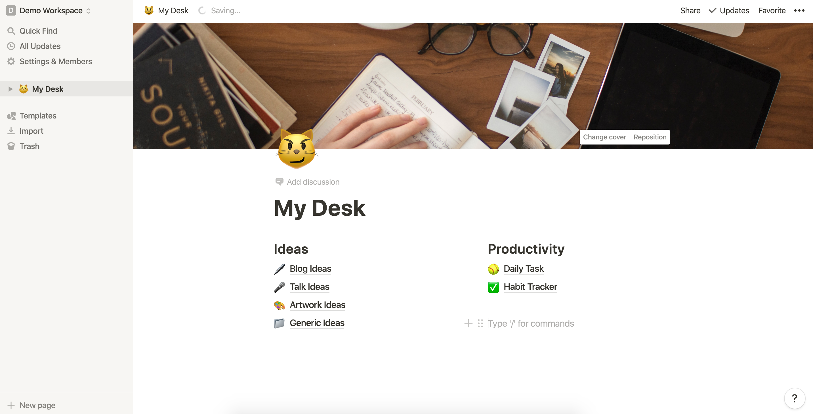

## Project Section Setup

This is similar to how we created the "Ideas" section. Just create a new "Project" heading and add the page below. I will be using Boards, feel free to experiment, and see what suits you.
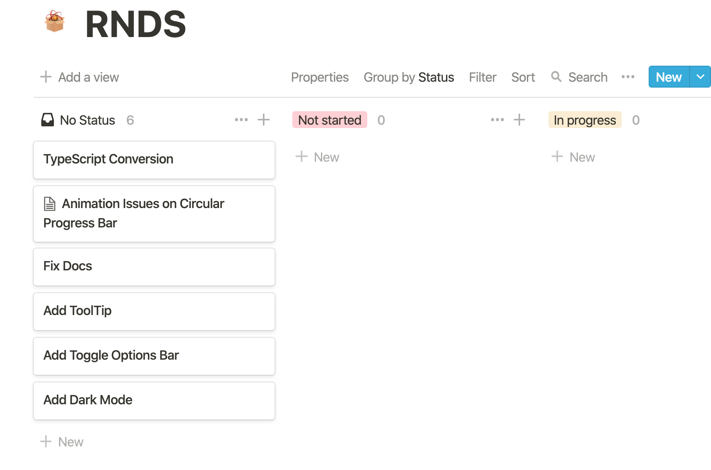

> It will be a good idea to add separate pages for separate projects.

## Learning Path Setup

When I'm learning something, I list out the things that I need to cover and create a todo list. This list will be in the order that I'm going to visit them. Our Board database can come handy in such use-cases.

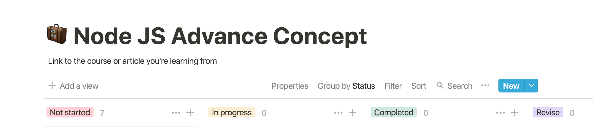

## Using Relations in Databases

We are using Databases here, and just like our relational databases, these pages can also have relations among them. You can refer to a different page inside a page. Go to **Add property** and select **Relation** inside the **Advanced** section.

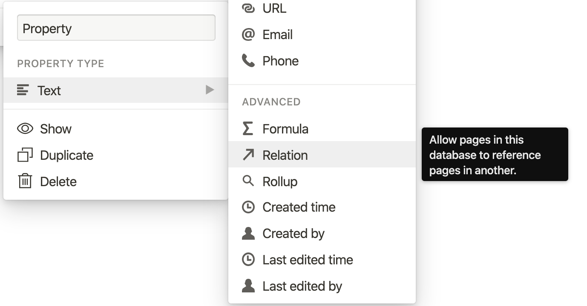

### When this is useful?

Suppose you're working for a bunch of clients and you have a database with there names and other important info. Let's name this database **Clients**. Let's say you have another page **Project Name** and you want to refer the client inside this project management page. You can easily do this by using **Relation** property of notion. Similarly, multiple columns can be connected to different pages. It becomes pretty handy if you know how to use it. 😉

> Read [this](https://www.notion.so/Relations-rollups-fd56bfc6a3f0471a9f0cc3110ff19a79#60feffab60594403a347fb0f62c01203) article for a detailed walkthrough.

I hope this is enough to get you started. You can explore the template gallery to see what's useful for you. There is no right or wrong here. What works for you is perfect so choose your preference and organize stuff.
This is how my complete setup looks: 

