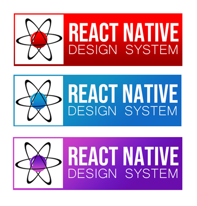

# Introducing React Native Design System (RNDS) 🎉🎉


Hey guys, I have been working on a library since a while now. It's a Design System around React Native and this blog answers some of the common questions that you might have. So let's start 😁.

# What is RNDS?
`RNDS` in short for `React Native Design System`. It's a set of component library and design rules that let's you build React Native apps faster. It's documented, tested in production and works on `Android`, `iOS` and `Web`. Visit this [link](https://rnds.netlify.com) for documentation.

# Why bother?
This title seems a little better than a generic title *Motivation*. So *Why bother to create a library?*  
I was working on different projects and copy pasting components I built over this past year.
I thought (like most devs) that it will be a good idea to make a package out of it and import it in any project.  
I did exactly that! I wanted something to prototype faster and it was a perfect solution.  
At first, I decided to add a bunch of props which is common across all the components to have a low API surface area because seriously *Who wants to remember a lot of props to use a component library?*  
I tried making it close to React Native itself so that I don't have to learn anything new. My goal was to create something that lets you get started in 10 minutes or less. (which is not that easy, I realized later 😅). I'm gonna go through my approach in the next section as `Failures` because that's where the magic happens.

# Failures and Learnings
I will discuss my failures and what I learned while making this. Most of the things are pretty common if you're familiar with design systems but I had to learn the hard way. I was solving my own problems.

## API
I wanted flexibity, freedom to create any component real quick so I added a bunch of props like `size`, `color` initially.   
`Size` props was supposed to take an integer value like `size={17}`. There was some calculation involved to create a component of appropriate size but possibilities were endless. I can basically create component from size say `10` to say `100` for example. I just had to try a bunch of number and see what fits.  
`color` was supposed to take a `hex code` of color and it will be the color of a component say `Button`. When you're working on a project, all you get is a color and it's easy to pass like that. So what failed?  
If you're experienced dev, you might have already guessed what an idiot I am but here me out. The problem was **With too much freedom comes too much inconsistency.**   

I was giving size and color to each usage of say `Button` and it's difficulty to maintain consistency when there are so many options available. `size={16}` and `size={17}` looks almost similar but are not. This was a big failure in terms of pixel-perfect design.  
Second problem was passing hex code to `color` prop. There aren't a lot of button when it comes to a real app. It means I was passing one single color to each and every button for no reason 😑.

The solution was using a tokenised system of configuration and restricting the possibilties to bare minimum.
> The key is to find the balance between Freedom and Consistency.

## Customization and Consistency
So as we talked above, solution for inconsistency was defining all the component specific configurations in a single file. It solved one more problem than it was supposed. Now, with everything at one place, it was much easier to customize component.
Suppose, I got 5 sizes of buttons as follows:

```js
theme = {
  buttonSize: {
    'xxsmall': 8,
    'xsmall': 10,
    'small': 12,
    'medium': 14,
    'large': 16,
    'xlarge': 18,
    'xxlarge': 20,
  },
  ...
}
```
It means I can simply do this to assign a different size according to my requirements:
```js
theme.buttonSize.medium = 15;
```
This also helps in making things consistent. There can be 7 different sizes of a components and I feel that's enough. Any more than that will just introduce ambiguity. You can always modify things (or add more) in theme file. This also works well for colors. Suppose, initially defined colors in theme file is as follows:
```js
theme = {
  brandColor: {
    'primary': '#1e88e5',
    'secondary': '#f9a825',
    'tertiary': '#e53935',
    'background': '#f8f8f8',
    ...
  },
}
```
You can easily change primary (or any) brand color as:
```js
theme.brandColor.primary = '#aeea00';
```
Sweet! Let's move on.

## Design Language
Everything is interlinked to one another. Solving first and second problem solved a third problem which I had no idea.  
Communication was a problem with earlier approach of `size` and `color`. You need to tell exact Number of size and Hex code if you want someone to create a button for you. Token based theme and restricting sizes eliminated this issue as well.  
You just have to say that "Hey, can you create a *medium* size button with a *primary* color?" That's it. It favours better communication and avoid redundancy.

## Design Rules
Prototyping an app is much more than just dropping components on screen. Space matters a lot more than actual components when you're working on frontend. Managing space on each component was my first approach but it was difficult.  
I added few seperate components which takes care of space only. These are `Layout components` like `Stack`, `Inline`, `Box` and `Card`. Their sole purpose is provide spacing to their childrens. You can go to playground of Stack in documentation for a live demo.  
All the other components like `Button`, `Badge`, etc have `0 margin`.

This separates the concerns in two:
1. A normal component should worry about only one thing: rendering a component of appropriate size.
2. A layout component should worry only about providing space to the compoment.

There are bunch of other rules that will be discussed later in this articles (Also available on docs).

> Layout components are inspired/stolen from [Braid Design System](https://github.com/seek-oss/braid-design-system#readme) 🙈

## Documentation
What good is a library if you don't know how to use it. A design system at its minimum is sum of Design Library + Design Rules + Documentation and it is supposed to boost your productivity. Which is certainly not possible if you waste your time figuring out how to use a component.

After creating the whole library, I instantly googled "How to document your library like a pro" and decided to use [React DocGen](https://github.com/reactjs/react-docgen). Wrote half the documentation but it wasn't working out well for me so I decided to go with [Docz](https://www.docz.site/docs/introduction). It's really good and I re-wrote the whole documentation for Docz but...

Then I went to a [Design System Meetup](https://www.linkedin.com/posts/iamshadmirza_designsystem-activity-6607961343033212928-zumR) organised by JSLovers and someone suggested to use [StoryBook](https://storybook.js.org/) instead. It was perfect and exactly what I needed. It's interactive playground not only helps you explore the components but also enables to create them in isolation a lot faster. With `StoryBook`, you don't even have to have to read the whole documentation. Just playing with the component in playground is enough.

So, for the third, I decided to rewrite the whole documentation with `StoryBook` in `MDX` and that's the final version what you will see at [rnds.netlify.com](https://rnds.netlify.com). 

There were other complications/hurdles on using `mdx` with React Native but I won't go in that much details. 

## Logo
After working so hard, all I wanted was it to be perfect and look at what I created at first 😂 👇


First thaught, definetely not good. So, after much thinking I created these, thanks to my photoshop skills:



Looks good but I can do better. So this is the final version after giving a hell lot of thaughts 👇.


This looks pretty satisfying and states my thoughts on why I created this too. 

So these were few of my failures while working on this. I learned a lot of things from webpack configs to compound components and a lot that I can't cover in this article. I know there are other great libraries available like [NativeBase](https://nativebase.io/) and [React Native Element](https://react-native-elements.github.io/react-native-elements/) but I was just trying to solve my own problems and this is the result of going through a lot of iteration.

> [Sanket Sahu](https://twitter.com/sanketsahu) and [Nader Debit](https://twitter.com/dabit3) have done a great job on the libraries mentioned above. The name `React Native Design System` was suggested by Nader himself and I'm thankful to him for helping me in building this.

# Design Rules
This section is the core of this library and I have spent most of my time iterating this to make it better. *`It's not much but it's honest work.`*  
It is based on the four key aspects that I considered while creating this.
> Feel free to send a PR for corrections, these are personal opinion and I'm here to learn. 😅

# 1. Low surface area
Most of the props are common across all components or they are the same as their parent component imported from React Native. This makes sure that you do not have to learn a whole set of extra props or just use what you already know.  
For example:
* If it's a Button, it receives all the props of Touchable component of React Native.
* If it's a Modal, it receives all the props of Modal.
* Each component receives a `size` prop whose value can be one of these: `xxsmall`, `xsmall`, `small`, `medium`, `large`, `xlarge` & `xxlarge`. You just have to pass `size` prop with one of these value and you're done.
* Another example could be `color` prop. You can pass one of the colors defined in `brandColor` of theme to any component.
* If it's a layout based component like `Box`, `Stack`, `Inline` or our best friend `Card` then it receives a `space` prop. This also takes one of the values between `xxsmall` and `xxlarge` ( with an addition of `space="none"`)  and provide appropriate spacing between components.
* Each component receives a `style` and a `textStyle` prop (if there is a text involved). This is for some rare cases when you have to override the default styling. It's preferable to tweak the `theme` instead to maintain consistency and avoid adding that `style` again and again.

These props are common to all the components. Other component-specific props are pretty straight forward too. 

# 2. Speed 
For most of the cases, default styles like `size={medium}` or `space={medium}` will be enough. In other cases, it's just two to three props max to achieve any desired result. This makes it faster to prototype. The layout components make it easier to achieve the desired screen layout with `space` props. See the playground in `Stack` documentation.

One of the key aspects of pixel-perfect design is the spacing between components. This design system proposes two things:

1. Every UI component has a margin of 0.
2. The spacing of any component will be determined by its parent Layout component.

The separation of concerns makes the job easier.  Layout component should take care of `space` only and UI component should worry about UI only i.e., `color` or `size`.

# 3. Consistency
The correct balance of freedom and consistency is hard to achieve.  

1. For freedom, you get straight forward props like `color` and `size`. 
2. For consistency, you need to define these configurations inside theme file i.e **Single source of truth**.

It helps in maintaining uniformity across all the usage. It also allows you to have several choices and use them as needed. Check out the theme section of this guide for the default configuration.

# 4. Connection
Big problems are always more manageable when broken into smaller pieces. The design language of the system is broken down into color, typography, size, and space. These API is followed by each component.

## Color
There are basically two types of colors:
* **brandColor:** "primary", "secondary", "tertiary", "background", "disabled", "semitransparent".
* **textColor:** "default", "heading", "grey", "subtle", "disabled", and "white"

## Typography
To keep things simple and consistent. There are two choices for fonts to use: 
* heading 
* text 

## Size
* The available sizes you can use is `"xxsmall"`, `"xsmall"`, `"small"`, `"medium"`, `"large"`, `"xlarge"` and `"xxlarge"`. The default is `"medium"` and it will be applied if are not passing anything.
* Font size is also similar and it ranges from "xxsmall" to "xxlarge".

## Space
Space also shares similar API as size but with one addition. You can also pass `"none"` with the range of `"xxsmall"` to `"xxlarge"`. Space is a dedicated prop for layout components like `Stack`, `Inline`, `Box` and `Card`.

> You can contribute to the theme. Please share what are the common color tokens you use, what are the common font sizes that you use in any app, etc. Let's make the theme config more generic together.

# Getting Started

## Install
Simply go to the command line and run this command.
```sh
yarn add react-native-design-system
```
You can use `yarn` or `npm` as per your choice.
```sh
npm install react-native-design-system
```
This library needs `react-native-vector-icons` so go on and install that too to get all the cool icons. Check out [Install guide](https://github.com/oblador/react-native-vector-icons#installation).

## Usage

### Step 1. Import `ThemeProvider` and `theme` then wrap your root component.
This step is important. We are passing `theme` as context value that each component will access.

```js
//your root component
import { ThemeProvider, theme } from 'react-native-design-system';

function App(){
  return (
    <ThemeProvider value={theme}>
      <Root />
    </ThemeProvider>
  );
}
```

### Step 2. Use component.

```js
//inside any file
import { Button } from 'react-native-design-system';

function HomeScreen(){
  return (
    <Button>
      Press Me
    </Button>
  );
}
```

> Visit [this](https://rnds.netlify.com/?path=/docs/guide-get-started--page) for more info.

# Reference:
Thanks to each person who helped me feedbacks.Other than that, these were talks and article which helped:

* [ReactLive 2019 - What goes into building a design system by Sidhharth Kshetrapal](https://www.youtube.com/watch?v=KtQO5MhnfEc)
* [ReactiveConf 2019 - Rethinking Design Practices by Mark Dalgleish](https://www.youtube.com/watch?v=jnV1u67_yVg&t=769s)
* [ReactConf 2019 - Building (And Re-Building) the Airbnb Design System | Maja Wichrowska & Tae Kim](https://www.youtube.com/watch?v=fHQ1WSx41CA)
* [React Advanced 2019 - Design Systems Design System by Siddharth Kshetrapal](https://www.youtube.com/watch?v=Dd-Y9K7IKmk&t=1204s)
* [Distilling How We Think About Design Systems by Sarah Federman](https://publication.design.systems/distilling-how-we-think-about-design-systems-b26432eefef9)
* [Everything you need to know about Design Systems by Audrey Hacq](https://uxdesign.cc/everything-you-need-to-know-about-design-systems-54b109851969)

> If this feels interesting, please drop a star on the repo. Click on this [link](https://github.com/iamshadmirza/react-native-design-system) Contributions are most welcome, you can reach [here](https://github.com/iamshadmirza/react-native-design-system/blob/master/CONTRIBUTING.md) to read contribution guidelines.
# Releasing React Native Design System (RNDS)

Hey guys, I have been working on a library for a while now. It's a Design System around React Native and this blog answers some of the common questions that you might stumble while going through the [repo](https://github.com/iamshadmirza/react-native-design-system). So let's start 😁.

# What is RNDS?
`RNDS` in short for `React Native Design System`. It's a set of component library and design rules that lets you build React Native apps faster. It's documented, tested in production and works on `Android`, `iOS` and `Web`. Visit this [link](https://rnds.netlify.com) for documentation.

# Why bother?
This title seems a little better than a generic title *Motivation*. So *Why bother to create a library?*  
I was working on different projects and copy-pasting components I built over this past year.
I thought (like most devs) that it will be a good idea to make a package out of it and import it in any project.  
I did exactly that! I wanted something to prototype faster and it was a perfect solution.  
At first, I decided to add a bunch of props which is common across all the components to have a low API surface area because seriously *Who wants to remember a lot of props to use a component library?*  
I tried making it close to React Native itself so that I don't have to learn anything new. My goal was to create something that lets you get started in 10 minutes or less. (which is not that easy, I realized later 😅). I'm gonna go through my approach in the next section as `Failures` because that's where the magic happens.

# Failures and Learnings
I will discuss my failures and what I learned while making this. Most of the things are pretty common if you're familiar with design systems but I had to learn the hard way. I was solving my own problems.

## API
I wanted flexibility, freedom to create any component real quick so I added a bunch of props like `size`, `color` initially.   
`Size` prop was supposed to take an integer value like `size={17}`. There was some calculation involved to create a component of an appropriate size but possibilities were endless. I can basically create a component from size say `10` to say `100`. I just had to try a bunch of numbers and see what fits.  
`color` was supposed to take a `hex code` of color and it will be the color of a component say `Button`. When you're working on a project, all you get is a color and it's easy to pass like that. So what failed?  
If you're experienced dev, you might have already guessed what an idiot I am but here me out. The problem was **With too much freedom comes too much inconsistency.**   

I provided `size` and `color` to each usage of *say* `Button` in a project and it's difficult to maintain consistency when there are so many options available. `size={16}` and `size={17}` looks almost similar but are not. This was a big failure in terms of pixel-perfect design.  
The second problem was passing the hex code to `color` prop. There aren't a lot of buttons when it comes to a real app. It means I was passing one single color to each and every button for no reason 😑.

The solution was using a tokenized system of configuration and restricting the possibilities to a bare minimum which covers most of the cases.
> The key is to find the balance between Freedom and Consistency.

## Customization and Consistency
So as we talked above, the solution for inconsistency was defining all the component-specific configurations in a single file. It solved one more problem than it was supposed. Now, with everything in one place, it was much easier to customize components.
Suppose, I got 5 sizes of buttons as follows:

```js
theme = {
  buttonSize: {
    'xxsmall': 8,
    'xsmall': 10,
    'small': 12,
    'medium': 14,
    'large': 16,
    'xlarge': 18,
    'xxlarge': 20,
  },
  ...
}
```
It means I can simply do this to assign a different size according to my requirements:
```js
theme.buttonSize.medium = 15;
```
This also helps in making things consistent. There can be 7 different sizes of components and I feel that's enough. Any more than that will just introduce ambiguity. You can always modify things (or add more) in the theme file. This also works well for colors. Suppose, we have initially defined colors in theme file is as follows:
```js
theme = {
  brandColor: {
    'primary': '#1e88e5',
    'secondary': '#f9a825',
    'tertiary': '#e53935',
    'background': '#f8f8f8',
    ...
  },
}
```
You can easily change primary (or any) brand color as:
```js
theme.brandColor.primary = '#aeea00';
```
Sweet! Let's move on.

## Design Language
Everything is interlinked with one another. Solving the first and second problems solved a third problem which I had no idea.  
Communication was a problem with the earlier approach of `size` and `color`. You need to tell the exact (number of) sizes and (string) Hex code if you want someone to create a button for you. Token-based theme and restricting sizes eliminated this issue as well.  
You just have to say that "Hey, can you create a *medium* size button with a *primary* color?" That's it. It favors better communication and avoids confusion.

## Design Rules
Prototyping an app is much more than just dropping components on a screen. Space matters a lot more than actual components when you're working on the frontend. Managing space on each component was my first approach but it was difficult.  
I added a few separate components which take care of space only. These are `Layout components` like `Stack`, `Inline`, `Box` and `Card`. Their sole purpose is to provide spacing to their children. You can go to the playground of Stack in the documentation for a live demo.  
All the other components like `Button`, `Badge`, etc have `0 margins`.

This separates the concerns in two:
1. A normal component should worry about only one thing: rendering a component of appropriate size.
2. A layout component should worry only about providing space to the component.

There are a bunch of other rules that will be discussed later in these articles (Also available on docs).

> Layout components are inspired/stolen from [Braid Design System](https://github.com/seek-oss/braid-design-system#readme) 🙈

## Documentation
What good is a library if you don't know how to use it. A design system at its minimum is the sum of Design Library + Design Rules + Documentation and it is supposed to boost your productivity. Which is certainly not possible if you waste your time figuring out how to use a component.

After creating the whole library, I instantly googled "How to document your library like a pro" and decided to use [React DocGen](https://github.com/reactjs/react-docgen). I wrote half the documentation but it wasn't working out well so I decided to go with [Docz](https://www.docz.site/docs/introduction). It's really good and I re-wrote the whole documentation for Docz but...

Then I went to a [Design System Meetup](https://www.linkedin.com/posts/iamshadmirza_designsystem-activity-6607961343033212928-zumR) organized by JSLovers and someone suggested to use [StoryBook](https://storybook.js.org/) instead. It was perfect and exactly what I needed. It's an interactive playground not only helps you explore the components but also enables to create them in isolation a lot faster. With `StoryBook`, you don't even have to have to read the whole documentation. Just playing with the component in the playground is enough.

So, for the third, I decided to rewrite the whole documentation with `StoryBook` in `MDX` and that's the final version that you will see at [rnds.netlify.com](https://rnds.netlify.com). 

There were other complications/hurdles on using `MDX` with React Native but I won't go in that much detail. 

## Logo
After working so hard, all I wanted was it to be perfect and look at what I created at first 😂 👇


First thought, definitely not good 😣. So, after much thinking I created these, thanks to my photoshop skills:


Looks good but I can do better. So this is the final version after giving a hell lot of thoughts 👇.


This looks pretty satisfying and states my thoughts on why I created this too. 

So these were a few of my failures while working on this. I learned a lot of things from webpack configs to compound components and a lot that I can't cover in this article. I know there are other great libraries available like [NativeBase](https://nativebase.io/) and [React Native Element](https://react-native-elements.github.io/react-native-elements/) but I was just trying to solve my own problems and this is the result of going through a lot of iteration.

> [Sanket Sahu](https://twitter.com/sanketsahu) and [Nader Debit](https://twitter.com/dabit3) have done a great job on the libraries mentioned above. The name `React Native Design System` was suggested by Nader himself and I'm thankful to him for helping me in building this.

# Design Rules
This section is the core of this library and I have spent most of my time iterating this to make it better. *`It's not much but it's honest work.`*  
It is based on the four key aspects that I considered while creating this.
> Feel free to send a PR for corrections, these are personal opinion and I'm here to learn. 😅

# 1. Low surface area
Most of the props are common across all components or they are the same as their parent component imported from React Native. This makes sure that you do not have to learn a whole set of extra props or just use what you already know.  
For example:
* If it's a Button, it receives all the props of Touchable component of React Native.
* If it's a Modal, it receives all the props of Modal.
* Each component receives a `size` prop whose value can be one of these: `xxsmall`, `xsmall`, `small`, `medium`, `large`, `xlarge` & `xxlarge`. You just have to pass `size` prop with one of these value and you're done.
* Another example could be `color` prop. You can pass one of the colors defined in `brandColor` of the theme to any component.
* If it's a layout based component like `Box`, `Stack`, `Inline` or our best friend `Card` then it receives a `space` prop. This also takes one of the values between `xxsmall` and `xxlarge` (with the addition of `space="none"`)  and provide appropriate spacing between components.
* Each component receives a `style` and a `textStyle` prop (if there is a text involved). This is for some rare cases when you have to override the default styling. It's preferable to tweak the `theme` instead to maintain consistency and avoid adding that `style` again and again.

These props are common to all the components. Other component-specific props are pretty straight forward too. 

# 2. Speed 
For most of the cases, default styles like `size={medium}` or `space={medium}` will be enough. In other cases, it's just two to three props max to achieve any desired result. This makes it faster to prototype. The layout components make it easier to achieve the desired screen layout with `space` props. See the playground in `Stack` documentation.

One of the key aspects of pixel-perfect design is the spacing between components. This design system proposes two things:

1. Every UI component has a margin of 0.
2. The spacing of any component will be determined by its parent Layout component.

The separation of concerns makes the job easier.  Layout component should take care of `space` only and UI component should worry about UI only i.e., `color` or `size`.

# 3. Consistency
The correct balance of freedom and consistency is hard to achieve.  

1. For freedom, you get straight forward props like `color` and `size`. 
2. For consistency, you need to define these configurations inside theme file i.e **Single source of truth**.

It helps in maintaining uniformity across all the usage. It also allows you to have several choices and use them as needed. Check out the theme section of this guide for the default configuration.

# 4. Connection
Big problems are always more manageable when broken into smaller pieces. The design language of the system is broken down into color, typography, size, and space. These API is followed by each component.

## Color
There are basically two types of colors:
* **brandColor:** "primary", "secondary", "tertiary", "background", "disabled", "semitransparent".
* **textColor:** "default", "heading", "grey", "subtle", "disabled", and "white"

## Typography
To keep things simple and consistent. There are two choices for fonts to use: 
* heading 
* text 

## Size
* The available sizes you can use is `"xxsmall"`, `"xsmall"`, `"small"`, `"medium"`, `"large"`, `"xlarge"` and `"xxlarge"`. The default is `"medium"` and it will be applied if are not passing anything.
* Font size is also similar and it ranges from "xxsmall" to "xxlarge".

## Space
Space also shares similar API as size but with one addition. You can also pass `"none"` with the range of `"xxsmall"` to `"xxlarge"`. Space is a dedicated prop for layout components like `Stack`, `Inline`, `Box` and `Card`.

> You can contribute to the theme. Please share what are the common color tokens you use, what are the common font sizes that you use in any app, etc. Let's make the theme config more generic together.

# Getting Started

## Install
Simply go to the command line and run this command.
```sh
yarn add react-native-design-system
```
You can use `yarn` or `npm` as per your choice.
```sh
npm install react-native-design-system
```
This library needs `react-native-vector-icons` so go on and install that too to get all the cool icons. Check out [Install guide](https://github.com/oblador/react-native-vector-icons#installation).

## Usage

### Step 1. Import `ThemeProvider` and `theme` then wrap your root component.
This step is important. We are passing `theme` as context value that each component will access.

```js
//your root component
import { ThemeProvider, theme } from 'react-native-design-system';

function App(){
  return (
    <ThemeProvider value={theme}>
      <Root />
    </ThemeProvider>
  );
}
```

### Step 2. Use component.

```js
//inside any file
import { Button } from 'react-native-design-system';

function HomeScreen(){
  return (
    <Button>
      Press Me
    </Button>
  );
}
```

> Visit [this](https://rnds.netlify.com/?path=/docs/guide-get-started--page) for more info.

# Reference:
Thanks to each person who helped me feedbacks. Other than that, these were talks and article which helped:

* [ReactLive 2019 - What goes into building a design system by Siddharth Kshetrapal](https://www.youtube.com/watch?v=KtQO5MhnfEc)
* [ReactiveConf 2019 - Rethinking Design Practices by Mark Dalgleish](https://www.youtube.com/watch?v=jnV1u67_yVg&t=769s)
* [ReactConf 2019 - Building (And Re-Building) the Airbnb Design System | Maja Wichrowska & Tae Kim](https://www.youtube.com/watch?v=fHQ1WSx41CA)
* [React Advanced 2019 - Design Systems Design System by Siddharth Kshetrapal](https://www.youtube.com/watch?v=Dd-Y9K7IKmk&t=1204s)
* [Distilling How We Think About Design Systems by Sarah Federman](https://publication.design.systems/distilling-how-we-think-about-design-systems-b26432eefef9)
* [Everything you need to know about Design Systems by Audrey Hacq](https://uxdesign.cc/everything-you-need-to-know-about-design-systems-54b109851969)

> If this feels interesting, please drop a star on the repo. Click on this [link](https://github.com/iamshadmirza/react-native-design-system) Contributions are most welcome, you can reach [here](https://github.com/iamshadmirza/react-native-design-system/blob/master/CONTRIBUTING.md) to read contribution guidelines.
