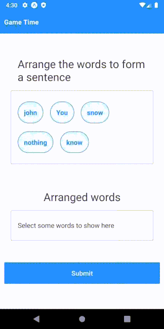
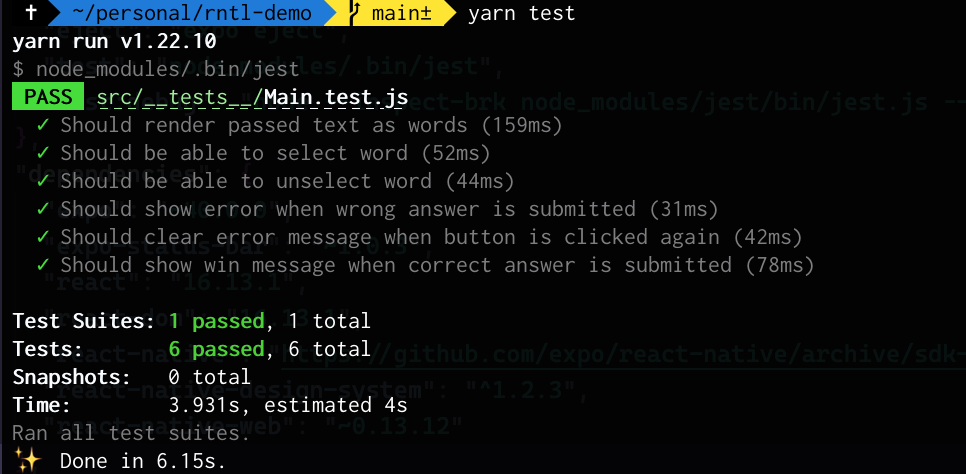
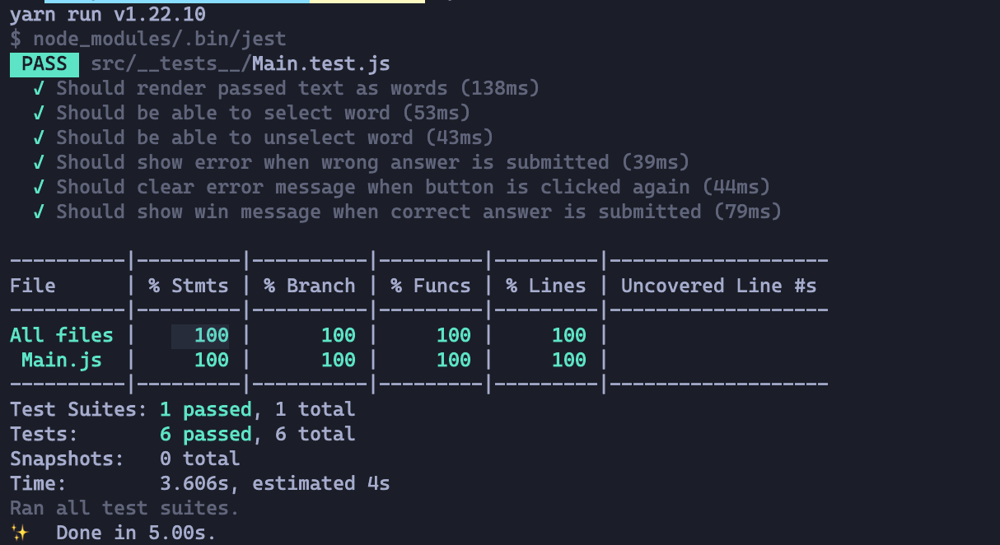
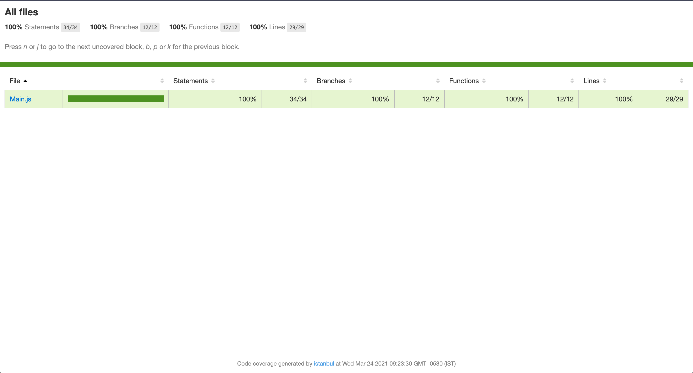

# A Definite Guide to React Native Testing Library

Hey everyone, this guide will teach you all about React Native Testing Library. We will cover why we would want to use this library, the benefits, how to write tests, and all sorts of stuff using an excellent game app. Let's start.

- [A Definite Guide to React Native Testing Library](#a-definite-guide-to-react-native-testing-library)
  - [What is RNTL and Why We Love It](#what-is-rntl-and-why-we-love-it)
  - [Hello World: My First Test](#hello-world-my-first-test)
  - [Let's Code: Create Word Warrior Game App](#lets-code-create-word-warrior-game-app)
    - [Step 1: Add boilerplate](#step-1-add-boilerplate)
    - [Step 2: Rendor UI](#step-2-rendor-ui)
    - [Step 3: Add functionality](#step-3-add-functionality)
  - [Install React Native Testing Library](#install-react-native-testing-library)
    - [If you're using expo](#if-youre-using-expo)
  - [Create Test Plan](#create-test-plan)
  - [Write Tests](#write-tests)
  - [More on Testing](#more-on-testing)
    - [Snapshot testing](#snapshot-testing)
    - [Mocking functions, fetch calls, external libraries](#mocking-functions-fetch-calls-external-libraries)
    - [Handling async calls with `waitFor.`](#handling-async-calls-with-waitfor)
  - [Test Coverage](#test-coverage)
  - [Test Coverage](#test-coverage-1)
  - [Takeaways](#takeaways)

## What is RNTL and Why We Love It

Tests are the best way to ensure the app's reliability. But let's be honest, testing is not easy to begin, and maintaining tests is even more troublesome. 

All the popular testing libraries like Enzyme, Jest, and Mocha are good. But they are tightly coupled with the components' implementation details, making them harder to maintain in the long run. CSS class selector or id's query elements tend to fail once you refactor or update the components.

Our tests should provide us confidence as well as they should be easy to maintain. RNTL helps with that by providing a nice wrapper around jest. It encourages the practice to write tests by keeping user interaction in mind.

**React Native Testing Library (RNTL)** exposes API to query elements by texts, labels, etc., instead of querying by classes, ids. It mimics the user's interaction by firing events instead of us updating the state manually. This way of writing tests closely resembles how the user will interact and makes the whole testing much more effortless. 

Even if the internal implementation, like classes, id changes over time, you can be sure that your test will work just fine. Let's learn the basics first, and then we will move to a more advanced section.

## Hello World: My First Test

Let's write a basic test to get an idea of how it works. Writing tests consists of a block of `test()` functions that performs some assertions to predict the outcome.

```js
test('Should add 2 number', () => {
    expect(2 + 2).toEqual(4);
});
```

We passed a description of test as the first argument and a callback with an assertion as second argument. We usually `expect` something to match or not match some value. Another example can be:

```js
test('Should add 2 number', () => {
    expect(2 + 2).not.toEqual(5);
});
```

You can use this `test` keyword interchangeably with `it.` We usually start with adding `test. Todo ()` with a description as the initial list of tests we will cover. We can also use `test.skip` to skip specific tests from running in the test suite.

We always name test files with `.test.js` or `.spec.js` suffix and add them inside a `__tests__` folder. This convention tells the test runner to look for files containing tests.

Now that we have some idea about testing. Let's move on to writing tests for a React Native app.

## Let's Code: Create Word Warrior Game App

We need a React Native app to add tests. You can use either `expo-cli` or `react-native-cli` to create the app. We will first create the app, then plan our tests using `test.todo()` and finally add all the examinations one by one.

Let's build a **Word Warrior Game** which gives a bunch of words in random order. Users have to select each word from the given words in a specific order to make a sentence. You win if you're able to get the sentence right 🎉.

The final app looks like this:



> You can skip this part and [jump straight to testing.](#install-react-native-testing-library)

### Step 1: Add boilerplate

Start with creating a React Native project and add a `Main.js` file.

> I'm using [react-native-design-system](https://www.npmjs.com/package/react-native-design-system) for generic components like Button, etc.

```js
// Main.js

// imports
import React, { useState } from 'react'
import { Stack, Card, Button, Text, Box, Header } from 'react-native-design-system';
import { ScrollView } from 'react-native'

export default function Main({ text }) {
    return (
        <ScrollView>
            <Header>Game Time</Header>
            <Stack>
                <Card shadow>
                    // show random words as question
                </Card>
                <Card shadow>
                    // show selected words as answer
                </Card>
                // show result 
            </Stack>
            <Card space="xsmall">
                <Button onPress={checkResult}>Submit</Button> // check result
            </Card>
        </ScrollView>
    );
}
```

We will use `text` to generate an array of random words. Then show those as questions and allow users to select/unselect them.

### Step 2: Rendor UI

We are going to randomize words from the text and render the `questions` array. We will also initialize the `result` and `answers array.

```js
import React, { useState } from 'react'
import { Stack, Card, Button, Text, Box, Header } from 'react-native-design-system';
import { ScrollView } from 'react-native'

function generateRandomString (text) {
    const array = text.split(' ');
    for (let i = array.length - 1; i > 0; i--) {
        const j = Math.floor(Math.random() * (i + 1));
        [array[i], array[j]] = [array[j], array[i]];
    }
  return array;
}

export default function Main({ text }) {
    const [question, setQuestion] = useState(generateRandomString(text)); // randomize words
    const [answer, setAnswer] = useState([]); // answer will be empty initially
    const [result, setResult] = useState(null); // true/false for result, null to reset
    
    return (
        <ScrollView>
            <Header>Game Time</Header>
            <Stack>
                <Card shadow>
                    // render questions array
                    <Box>
                        <Text size="xlarge">Arrange the words to form a sentence</Text>
                    </Box>
                    <Card outline>
                        <Stack direction="horizontal" accessibilityLabel="questions" verticalSpace="xsmall" cropEndSpace>
                            {question.length > 0
                                ? question.map((item, index) => (
                                    <Button key={index} outline round onPress={() => selectWord(item)}>{item}</Button>
                                ))
                                : <Text>Click submit to check result</Text>
                            }
                        </Stack>
                    </Card>
                </Card>
                <Card shadow>
                    // render answers array
                    <Box>
                        <Text size="xlarge">Arranged words</Text>
                    </Box>
                    <Card outline>
                        <Stack direction="horizontal" accessibilityLabel="answers" verticalSpace="xsmall" cropEndSpace>
                            {answer.length > 0
                                ? answer.map((item, index) => (
                                    <Button key={index} outline round onPress={() => unselectWord(item)}>{item}</Button>
                                ))
                                : <Text>Select some words to show here</Text>
                            }
                        </Stack>
                    </Card>
                </Card>
                // render results
                {result !== null
                    ? (
                        <Box space="xsmall">
                            <Text size="large" style={{ color: result ? 'green' : 'red'}}>
                                {result ? 'Correct answer 🥳' : 'Wrong answer 😢'}
                            </Text>
                        </Box> 
                    )
                    : null
                }
            </Stack>
            <Card space="xsmall">
                <Button onPress={checkResult}>Submit</Button>
            </Card>
        </ScrollView>
    );
}
```

We have a nice UI now. Let's add some button handlers.

### Step 3: Add functionality

```js
// ...imports

export default function Main({ text }) {
    const [question, setQuestion] = useState(generateRandomString(text));
    const [answer, setAnswer] = useState([]);
    const [result, setResult] = useState(null)

    const selectWord = (word) => {
        const newQuestionArray = question.filter(item => item !== word);
        const newAnswerArray = [...answer, word];
        setQuestion(newQuestionArray);
        setAnswer(newAnswerArray);
        resetResult();
    }

    const unselectWord = (word) => {
        const newAnswerArray = answer.filter(item => item !== word);
        const newQuestionArray = [...question, word];
        setAnswer(newAnswerArray);
        setQuestion(newQuestionArray);
        resetResult();
    }

    const checkResult = () => {
        if (answer.join(' ') === text){
            setResult(true);
        } else {
            setResult(false);
        }
    }

    const resetResult = () => {
        setResult(null);
    }
    
    return (
        <ScrollView>
            // render ui
        </ScrollView>
    );
}
```

Also, import this `Main.js` file inside `App.js.`

```js
// App.js
import React from 'react';
import { ThemeProvider, theme } from 'react-native-design-system';
import Main from './src/Main';

export default function App() {
  const text = "You know nothing john snow";
  return (
    <ThemeProvider value={theme}>
      <Main text={text} />
    </ThemeProvider>
  );
}
```

Perfect! Our app is ready now. Let's move on to Part 2.

## Install React Native Testing Library

Open a Terminal and run this command:
Using yarn

```sh
yarn add --dev @testing-library/react-native
```

Using npm

```sh
npm install --save-dev @testing-library/react-native
```

This library has a peerDependencies listing for `react-test-renderer` and, of course, react. Make sure to install them too!

To use additional React Native-specific jest matchers from the `@testing-library/jest-native` package, add it to your project:

Using yarn

```sh
yarn add --dev @testing-library/jest-native
```

Using npm

```sh
npm install --save-dev @testing-library/jest-native
```

Then automatically add it to your jest tests by using setupFilesAfterEnv option in your Jest configuration (it's usually located either in package.json under the "jest" key or in a jest.config.js file):

```JSON
{
  "preset": "react-native",
  "setupFilesAfterEnv": ["@testing-library/jest-native/extend-expect"]
}
```

### If you're using expo

Install `jest-expo` add this to your package.json

```json
"scripts": {
    //... other scripts
    "test": "node_modules/.bin/jest",
    "test:debug": "node --inspect-brk node_modules/jest/bin/jest.js --runInBand"
},
"jest": {
    "preset": "jest-expo",
    "setupFilesAfterEnv": [
      "@testing-library/jest-native/extend-expect"
    ]
},
```

> Spoiler alert! We are entering into test-driven development now.

## Create Test Plan

Now we will write a list of what areas we want to test. Think about how the user is going to interact with the app. Then test that function.

For our app, we want the random words to be visible initially. We want the user to be able to select and unselect words. We have to make sure words in questions pop into the answer section when we click them. We also have to check if the Submit button is working fine and showing the result correctly.

Based on these specs, our tests can look like:

```js
// src/__tests__/Main.test.js

test.todo('Should render passed text as words');

test.todo('Should be able to select the word');

test.todo('Should be able to unselect word';

test.todo('Should show an error when wrong answer is submitted');

test.todo('Should clear error message when we click the button again');

test.todo('Should show win message when a correct answer is submitted');
```

We now have a plan on what tests to write. Let's go to the next section and write tests.

## Write Tests

Let's understand what happens when you write a unit test for React Native component. The steps are which takes place:

- Render the component
- Query element of the rendered component
- Add assertions

Let's write our first unit test by keeping the above three points in mind.

```js
// imports
import React from 'react';
import { render, fireEvent, within, cleanup } from '@testing-library/react-native';
import { ThemeProvider, theme } from 'react-native-design-system';
import Main from '../Main';

// theme provider for components
const useTheme = (children) => {
    return (
        <ThemeProvider value={theme}>
            {children}
        </ThemeProvider>
    );
}

test('Should render passed text as words', () => {
    // render the component
    const { getByA11yLabel } = render(useTheme(<Main text="One Two Three Four Five" />));
    // query elements 
    const questions = getByA11yLabel('questions');
    const oneButton = within(questions).getByText('One');
    // add assertions
    expect(oneButton).toBeDefined();
});
```

Let's see what's happening here:

- We imported a bunch of methods from `@testing-library/react-native.
- We changed `test.todo()` to `test()` and added a callback function
- This function rendered the `Main.js` screen and returned some methods to query elements.
- We get the question container using `getByA11yLabel()`
- We check if the word **"One"** is defined inside questions using `within.`

We will follow similar steps with all the test cases. Let's add the second one. (I'll add comments for better understanding)

```js
test('Should be able to select word', () => {
    // render component
    const { getByText, getByA11yLabel } = render(useTheme(<Main text="One Two Three Four Five" />));
    // query element
    const button = getByText('One');
    // fireEvent just like a user would do
    fireEvent.press(button);
    const answers = getByA11yLabel('answers');
    // add assertions
    const selectedButton = within(answers).getByText('One');
    expect(selectedButton).toBeDefined();
});
```

`@testing-library/react-native` also gives us this `fireEvent` module which helps us mimic user's behavious. We can use it to:

- click a button by `fireEvent.press(button);`. 
- write some texts by `fireEvent.changeText(input, 'I typed something');`
- scroll to any position by `fireEvent.scroll(getByTestId('flat-list'), { nativeEvent: {
    contentOffset: { y: 200 }}});`

Let's look at the third one:

```js
test('Should be able to unselect word', () => {
    // render component
    const { getByText, getByA11yLabel } = render(useTheme(<Main text="One Two Three Four Five" />));
    // query element
    const button = getByText('One');
    //select word
    fireEvent.press(button);
    const answers = getByA11yLabel('answers');
    const selectedButton = within(answers).getByText('One');
    // add assertion
    expect(selectedButton).toBeDefined();
    //unselect word
    fireEvent.press(selectedButton);
    const questions = getByA11yLabel('questions');
    const unselectedButton = within(questions).getByText('One');
    // add assertion
    expect(unselectedButton).toBeDefined();
});
```

Sometimes, we can't simply test if the element is defined and visible on the screen. We have to be very specific where the element is rendered. 

Specifically, in cases like this where we pop words from one container to another. `within` comes very handy in these situations and encourages better code practice. i.e., we added `accessibilityLabel` to the container, which we would have missed otherwise.

Let's move on to the next test.

```js
test('Should show error when wrong answer is submitted', () => {
    const { getByText } = render(useTheme(<Main text="One Two Three Four Five" />));
    const button = getByText('One');
    fireEvent.press(button);
    const submitButton = getByText('Submit');
    fireEvent.press(submitButton);
    const failureMessage = getByText('Wrong answer 😢');
    expect(failureMessage).toBeDefined();
});
```

Here, we got the text's failure message, which will work even when the styles or classes are changed. This practice of testing of getting elements by text and not some class makes the test much more maintainable over time.

```js
test('Should clear error message when button is clicked again', () => {
    //check if error appears
    const { getByText } = render(useTheme(<Main text="One Two Three Four Five" />));
    const submitButton = getByText('Submit');
    fireEvent.press(submitButton);
    const failureMessage = getByText('Wrong answer 😢');
    expect(failureMessage).toBeDefined();
    //check if error message dissapears
    const button = getByText('One');
    fireEvent.press(button);
    expect(() => getByText('Wrong answer 😢')).toThrow("Unable to find an element with text: Wrong answer 😢");
});
```

We can use callback inside `expect` coupled with `toThrow` assertion to check if the element doesn't exist on the screen. Let's add the last test.

```js
test('Should show win message when correct answer is submitted', () => {
    const { getByText } = render(useTheme(<Main text="One Two Three Four Five" />));

    const buttonOne = getByText('One');
    fireEvent.press(buttonOne);

    const buttonTwo = getByText('Two');
    fireEvent.press(buttonTwo);

    const buttonThree = getByText('Three');
    fireEvent.press(buttonThree);

    const buttonFour = getByText('Four');
    fireEvent.press(buttonFour);

    const buttonFive = getByText('Five');
    fireEvent.press(buttonFive);

    // check result
    const submitButton = getByText('Submit');
    fireEvent.press(submitButton);
    
    const successMessage = getByText('Correct answer 🥳');
    expect(successMessage).toBeDefined();
});
```

It's good practice to clean up the rendered output after each test. RNTL provide us two hooks i.e. `beforeEach()` & `afterEach()` that let us run any command before and after each test. We can use afterEach for cleanup purposes and pass the `cleanup` module we import from `@testing-library/react-native earlier.

```js
import React from 'react';
import { render, fireEvent, within, cleanup } from '@testing-library/react-native';
import { ThemeProvider, theme } from 'react-native-design-system';
import Main from '../Main';

afterEach(cleanup);
```

Once done, run the tests using `yarn test` and see if the tests are passing.



We successfully tested our mini-game app and looked at some ways to query data and assert values. You can follow [this guide](https://testing-library.com/docs/queries/about/) to get familiar with other querying methods.

> You can find project code on this [GitHub Repo](https://github.com/iamshadmirza/rntl-demo)

These were some of the basic cases of unit testing in React Native. Let's look at some other type.


## More on Testing

There is more to testing than simply rendering and asserting values. Sometimes, you have to mock function calls or wait for some promise to resolve before checking the output. Let's look at some of these scenarios:

- Snapshot testing
- Mocking functions, fetch calls, external libraries
- Handling async calls with `waitFor.`

### Snapshot testing

Snapshot testing ensures that UI stays consistent. We will be using `react-test-renderer` to render React Native component into pure javascript objects. This object will then be saved as snapshot and compared every time the test runs.

```js
import React from 'react';
import { create } from 'react-test-renderer';
import Main from '../Main';
import { ThemeProvider, theme } from 'react-native-design-system';

const useTheme = (children) => {
    return (
        <ThemeProvider value={theme}>
            {children}
        </ThemeProvider>
    );
}

const tree = create(useTheme(<Main text="One" />));

test('snapshot', () => {
    expect(tree).toMatchSnapshot();
});
```

Once the UI breaks, the test will start failing. You can then use `yarn test -u` to update the screenshot with the latest UI.

> We passed one word to get consistent UI on every render. Since the game generates a random sequence of words every time, it will fail to give multiple words.

### Mocking functions, fetch calls, external libraries

The idea is to use `jest.fn()` to mock external library calls or fetch calls. We don't want to hit API and get actual data every time the test suit runs. We will mock the function implementation and use the promise to return the data that we want. Promise will be returned instantly.

```js
// add mock function for fetch

global.fetch = jest.fn({
    json: () => Promise.resolve({ data: 'some data' }),
  });
```

The above will mock the implementation of fetch calls and return `{ data: 'some data'}` when `response.json()`

Then we can check if the fetch was called or not by:

```js
expect(global.fetch).toHaveBeenCalledWith(
    'api-route',
    {
      method: 'GET',
      headers: {'Content-Type': 'application/json'},
    },
)
```

Similarly, we can mock external libraries. Let's take an example of `@react-native-community/async-storage.`

```js
import AsyncStorage from '@react-native-community/async-storage'

jest.mock('@react-native-community/async-storage', () => ({ setItem: jest.fn() }));

test('should set async storage', () => {
  expect(AsyncStorage.setItem).toHaveBeenCalledTimes(1);
});
```

When we call `AsyncStorage.setItem`, it will call the mocks function instead of the actual one. We can use all sorts of assertions on the mocks function instance.

### Handling async calls with `waitFor.`

Some calls are asynchronous, and we have to wait for some time till the UI renders and we can assert some values. One example could be navigation in React Native. You click the button to navigate to a different screen. It takes a while before you can check if navigation happened or not. `waitFor` is used in such scenarios. Let's take an example of `react-navigation.`

```js
import React from 'react';
import { fireEvent, render, waitFor } from '@testing-library/react-native';
import { useNavigation } from '@react-navigation/native';

jest.mock('@react-navigation/native', () => {
  return {
    createNavigatorFactory: jest.fn(),
    useNavigation: jest.fn(),
  }
});

test('Should navigate', () => {
    const mockNavigate = jest.fn();
    await waitFor(() => expect(mockNavigate).toHaveBeenCalledTimes(1));
    expect(mockNavigate).toHaveBeenCalledWith('Home');
})
```

## Test Coverage

It's fairly easy to generate report and see how much test coverage you have. To do so, just go to `package.json` and add this:

```json
"jest": {
    "preset": "jest-expo",
    "setupFilesAfterEnv": [
      "@testing-library/jest-native/extend-expect"
    ],
    "collectCoverage": true // add this property inside jest
},
```

And we are done 🎉. Now you'll see a coverage report in the terminal every time you run the test.



You will also notice a `coverage` folder created that contains all the generated test reports. You can see these reports on the browser like this:



## Test Coverage

It's fairly easy to generate report and see how much test coverage you have. To do so, just go to `package.json` and add this:

```json
"jest": {
    "preset": "jest-expo",
    "setupFilesAfterEnv": [
      "@testing-library/jest-native/extend-expect"
    ],
    "collectCoverage": true // add this property inside jest
},
```

And we are done 🎉. Now you'll see a coverage report in the terminal every time you run the test.


You will also notice a `coverage` folder created that contains all the generated test reports. You can see these reports on the browser like this:


## Takeaways