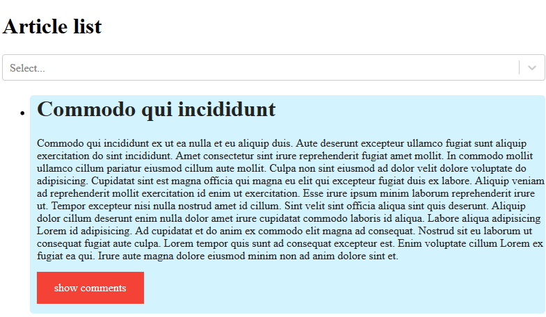

# Styling and animation in React


Today we are going to add some styling and animation in our React app. We will also talk about the performance aspect of our app and how we can control re-rendering with the `shouldComponentUpdate` lifecycle method. Let's start.

## Adding CSS
We are going to add CSS to `Article.js` file but before that let's create a separate directory which will contain both `Article.js` and it's `style.css`.

1. Create `Article` directory and move `Article.js` inside it.
2. Rename `Article.js` to `index.js`.
3. Create a stylesheet `style.css` inside `Article` directory
3. Update imports
```js 
import CommentList from "../CommentList";
import "./style.css";
```

Now we will add a `className` property to the div we want to style
```js
return (
      <div className="article">
        <h1 onClick={openArticle}>{title}</h1>
        ...
```
Let's add some CSS in the stylesheet for class `article` we just added.

```css
/* article style */
.article {
  background-color: #d3f4ff;
  border-radius: 5px;
  padding-left: 10px;
  color: #222;
}
```
We can also add sometime styling to the links and make it more like a button
```css
/* link style */
a:link,
a:visited {
  background-color: #f44336;
  color: white;
  padding: 14px 25px;
  margin: 14px 0px;
  text-align: center;
  text-decoration: none;
  display: inline-block;
}

a:hover,
a:active {
  background-color: red;
}
```
Our app is starting to look better now:



Let's understand the animation now:

## CSS Animation
There are some addons/libraries which makes our job easier. One such library is [`react-transition-group`](https://github.com/reactjs/react-transition-group). It manages our component state over time and controls the animation after we define how we want it to be.

### Install the module
You can use npm or yarn upon your choice.
```sh
yarn add react-transition-group
```

### Import the module in `Article.js` and wrap the component which we want to animate
The library provides `CSSTransition` which accepts some props and takes care of the animation.

```js
//import
import { CSSTransition } from "react-transition-group";

//inside render
return (
  <div className="article">
    <h1 onClick={openArticle}>{title}</h1>
    <CSSTransition
      in={isOpen}
      timeout={500}
      classNames="article"
      unmountOnExit
    >
      <section>
        {text} <CommentList comments={comments} />
      </section>
    </CSSTransition>
  </div>
);
```
* `in` prop of `CSSTransition` expects a boolean value that marks the enter and exit of animation. 
* We provide a `classNames` prop as `CSSTransition` applies a pair of class names during the appear, enter, and exit states of the transition.
* Child component receives a set of class upon value of `in` prop. Let's add these class and animation inside `style.css`

```css
/* animation style */
.article-enter {
  opacity: 0;
  transform: scale(0.8);
}
.article-enter-active {
  opacity: 1;
  transform: translateX(0);
  transition: opacity 300ms, transform 300ms;
}
.article-exit {
  opacity: 1;
}
.article-exit-active {
  opacity: 0;
  transform: scale(0.8);
  transition: opacity 300ms, transform 300ms;
}
```
These classes watch for the child element when they appear or vanish i.e. *enter or exit*. The CSS properties defined inside these class will animate the child element accordingly.

> Visit this [link](https://reactcommunity.org/react-transition-group/css-transition) to learn more about the properties available.

And we are done with our simple CSS animation. Now let's move on to enhance the performance of our app.

## Performance
Let us recall how React works. It watches for state changes and updates Virtual DOM. In our case whenever we open or close any article, we are changing the app state triggering a re-render. This can lead to performance issues. Luckily, React gives us a method that can specify when we want to update our app.

## shouldComponentUpdate
```js
shouldComponentUpdate(nextProps, nextState)
```
The default behavior of any React component is to re-render whenever the state changes. We can use `shouldComponentUpdate()` to let React know if a component’s output is not affected by the current change in state or props.  
Render trigger upon the value we return from this method (default is `true`). `shouldComponentUpdate()` is invoked before rendering when new props or states are being received. This method is not called for the initial render or when forceUpdate() is used.

Let's add this method in our `CommentList` component.
```js
shouldComponentUpdate(nextProps, nextState) {
  return nextProps.isOpen != this.props.isOpen;
}
```
When this method is invoked, React will know whether there is any change or not and it will re-render accordingly.  
You might be wondering if we do the same with cpmments:

```js
return nextProps.isOpen != this.props.isOpen || (nextProps.comments != this.props.comments);
```
This will not work as we are receiving same array so `nextProps.comments` and `this.props.comments` is always **same**. That's why React favvours `Immutable` data. It simply means the data never changes or *cannot be modified*. 

## Immutable data
Immutable data cannot be changed once created, leading to much simpler application development. React can watch for state changes much effectively eliminating performance issues.  

Let us look at [Immutable.js](https://github.com/immutable-js/immutable-js) for instance. Using this type of data is pretty handy, looking from the very React programming paradigm point of view. React is frequently associated with functional programming. So, what ideas does functional programming use? Let us list them:

1. Functions should be objects of the first order, i.e. you can use their variables, return them as another function’s results, transmit a function as arguments.
2. Pure functions are those working only with internal functions. Stable functions can be used anywhere and are liked by many.
3. Immutable data never change. These are data that were initially created and get no change. It means, to change data in a new object, a new object with changes will be created, but an old one will be accessible, too.

In our case, you will always be able to write this kind of shouldComponentUpdate, where you will have an opportunity to compare old and new comments, and it will speed up your work on developing the app.

In your home task, you will need to read documents on [Immutable.js](https://immutable-js.github.io/immutable-js/docs/#/). Next time we will talk about `Redux`.  
We will also need to integrate a third-party component `day-picker`. It will be added to our `Select` and present a selected range of dates by the “ArticleList for” and date. It is a calendar, where you can select a needed date and use it for filtration.

The lesson code together with previous lesson materials can be found [here](https://github.com/soshace/react_lessons/tree/Lesson_6).