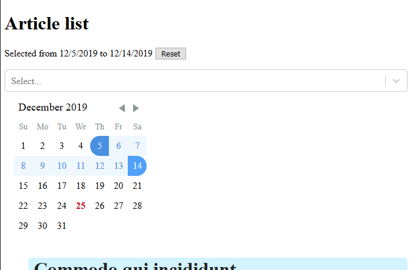
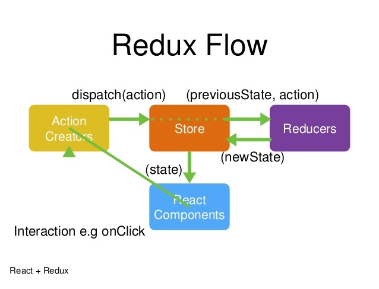

# Redux


Today we're going to learn Redux but we will complete the homework from the last lesson. We are going to add a calendar. Remember when we learned how to take help from the amazing world of Open-Source? This is one of those times. We are going to add the day picker module built and tested by the react community. Let's get started.

## Install react-day-picker
You can use either yarn or npm as convenient:
```sh
yarn add react-day-picker
```
## Import module and CSS inside ArticleList

```js
import DayPicker, { DateUtils } from "react-day-picker";
import "react-day-picker/lib/style.css";
```
## Update state
`DayPicker` expects `to` and `from` value. Let's add it to the state:
```js
state = {
  selectedArticles: null,
  from: undefined,
  to: undefined
};
```
## Add DayPicker inside render"
```js
const { from, to } = this.state;
const modifiers = { start: from, end: to };
return (
  <div>
    <h1>Article list</h1>
    <Select
      options={options}
      isMulti={true}
      value={this.state.selectedArticles}
      onChange={this.handleSelectChange}
    />
    <DayPicker
      className="Selectable"
      selectedDays={{ from, to }}
      modifiers={modifiers}
      onDayClick={this.handleDayClick}
    />
    <ul>{this.renderListItem()}</ul>
  </div>
);
```
`className` add styling to date picker. `selectedDays` expects you to pass `from` and `to` day to be shown on calender. Let's add `handleSelectChange` method to save user reponse.

## Add click handler
```js
handleDayClick = day => {
  const range = DateUtils.addDayToRange(day, this.state);
  const { from, to } = range;
  this.setState({ from, to });
};
```
## Finally, add a small function to render day picker
```js
getRangeTitle() {
  const { from, to } = this.state;
  return (
    <p>
      {!from && !to && "Please select the first day."}
      {from && !to && "Please select the last day."}
      {from &&
        to &&
        `Selected from ${from.toLocaleDateString()} to
              ${to.toLocaleDateString()}`}{" "}
      {from && to && (
        <button className="link" onClick={this.handleResetClick}>
          Reset
        </button>
      )}
    </p>
  );
}

//to reset date
handleResetClick = () => {
  this.setState({ from: undefined, to: undefined });
};

//render getRangeTitle()
render(){
  //...
  return(
      <div>
        <h1>Article list</h1>
        {this.getRangeTitle()}
        {/* previously added code...*/}
      </div>
  );
}

```

Let's see how it looks:



> You can visit [documentation](https://react-day-picker.js.org/) for more information.

We can see that our component state is getting more complex and we are losing atomicity. It means that one component should take one single task. We added `Select` and `DayPicker` together and this is the first sign we have to take care of State Management.  
With the increasing complexity of our app, it is very easy to introduce bugs because of poor state management. The React team offered a solution on logics building – **Unidirectional Data Flow**. So, let us see Redux working principles:

## Redux
Redux is a predictable state container that supports the idea of a *single source of truth*. This simply means that the complete state of the application will reside in one place only.   
Redux is more focused on the concepts of functional programming and is inspired by Flux: *A uni-directional way of updating Views and handling user actions*.



## Concept
As we can see in the image above. Redux consist of mainly 4 components.
We will go through each of them and build a basic counter using redux.
First, install the required modules:

```sh
yarn add redux react-redux
```

## 1. Store
A store is just a container that contains the state of our whole application in an object tree. This is also called as *"Single source of truth"* This makes debugging easier.  

Let's create a new directory `store` and add a `index.js` file:

```js
import { createStore } from "redux";
import reducer from "../reducers";

const store = createStore(reducer);

export default store;
```
The store receives a `reducer` which we will see in a minute. But first, let's see actions.

## Actions
Another important concept is that **State is Read-Only**.
The only way to change the state is to emit an action, an object describing what happened. *In short, actions are a piece of code that tells how to change state.*   
Let's create a new directory `actions` and write two actions inside `index.js` to increment and decrement the counter.

```js
import { INCREMENT, DECREMENT } from "../types";

export const increment = () => {
  return {
    type: INCREMENT
  };
};

export const decrement = () => {
  return {
    type: DECREMENT
  };
};
```

Types are just to specify the type of action triggered. We will use it inside the reducer. I have defined types inside a different file to avoid misspelling.

```js
export const INCREMENT = "increment";
export const DECREMENT = "decrement";
```

## Reducers
Views cannot change the state DIRECTLY! It means the only way to update views is to trigger a state change inside reducer.  
In Redux, you dispatch actions. These actions tell a reducer to update the state. Redux docs also recommend not mutating the state. Each action instructs the reducer to replace the existing state with a new version.  
Let's create a `reducers` directory and `index.js` file inside it.

```js
//import type constants
import { INCREMENT, DECREMENT } from "../types";

// state to begin with
const INITIAL_STATE = {
  count: 0
};

// switch action based on types
export default (state = INITIAL_STATE, action) => {
  switch (action.type) {
    case INCREMENT:
      return { ...state, count: state.count + 1 };
    case DECREMENT:
      return { ...state, count: state.count - 1 };
    default:
      return state;
  }
};
```
Reducers are just pure functions that returns a new state everytime we dispatch an action which in turns re-render the `View`. 

## View
We need to access this state inside our component. Let's see how we can do that:

### Step 1:
Let's create a component `Counter` to show `count` and trigger increment or decrement action

```js
import React, { Component } from "react";
import PropTypes from "prop-types";
import { connect } from "react-redux";
import { increment, decrement } from "../actions";

class Counter extends Component {
  static propTypes = {
    count: PropTypes.number,
    increment: PropTypes.func
  };

  handleIncrement = e => {
    e.preventDefault();
    this.props.increment();
  };

  handleDecrement = e => {
    e.preventDefault();
    this.props.decrement();
  };

  render() {
    return (
      <div>
        <h1>{this.props.count}</h1>
        <a href="#" onClick={this.handleIncrement}>
          increment
        </a>
        <a href="#" onClick={this.handleDecrement}>
          decrement
        </a>
      </div>
    );
  }
}

const mapStateToProps = state => {
  return {
    count: state.count
  };
};

export default connect(
  mapStateToProps,
  { increment, decrement }
)(Counter);
```
We are using a connect function to connect our component with the store. Connect function is a Higher-Order component that adds extra functionality to our component. It receives few arguments.

* One is `mapStateToProps` which let us access redux state inside the component.
* The second argument is `mapDispatchToProps` which takes actions that we need to dispatch.

### Step 2:
We have to wrap our whole application with Provider from 'react-redux' and pass the store. Update root file as:

```js
//add imports
import Counter from "./components/Counter";
import { Provider } from "react-redux";
import store from "./store";

function App() {
  return (
    <Provider store={store}>
      <Counter />
    </Provider>
  );
}
```
Visit this [codesandbox](https://codesandbox.io/s/reactlessonlesson7-ss0tp) to see counter in action.
