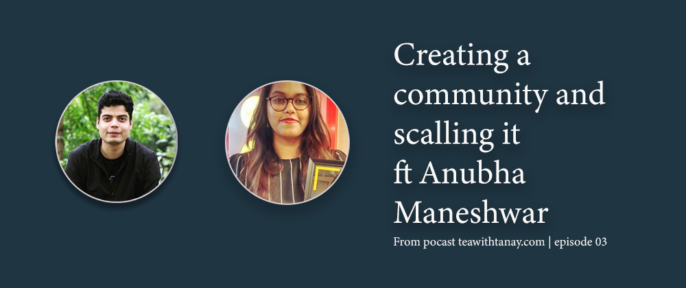

# Creating community and scaling it too ft Anubha Maneshwar
  

In episode 3, [Anubha Maneshwar](https://www.linkedin.com/in/anubhamane/), founder of GirlScript project which helps beginners get started with coding, joins Tanay to share her journey of building a community and growing it. In the episode, she talks about how she got stated and how she got people excited about her vision for GirlScript.  
[Anubha Maneshwar](https://www.linkedin.com/in/anubhamane/) is the founder of GirlScript, Mozilla Web Group, Dev Rally in Hasura, and have won the Indian Women Leadership Award for Education. Anubha Maneshwar is the winner of 35 Under 35 Awards in Best Startup for Education Category and India’s Top 100 Young Leaders Award.

## *Anubha and GirlScript*
GirlScript right now is in 52 cities of India, in Chicago, China, Africa, and it's about to come to the UK in two years.
GirlScript aims to help beginners learn and get suitable exposure.
Anubha's journey starts from a small college in Nagpur and goes all the way to Google Women Tech Makers in Hyderabad.  
She got a chance to attend Google Tech Maker International women's day celebration which made her realize how far the community is lagging. It then led her to become a part of the Mozilla Web Community along with a few other communities as well. After being a part of more than 10 communities she realized that there is a gap she can fill and that's how GirlScript came into existence.

## *How did you come up with the name GirlScript ?*
Anubha talks about an event when she with her classmates were interviewing for a company. When it came to the programming round, others started to step back. That's where she realized that women in tech are taking a set back themselves and they need support.  
GirlScript is an organization that provides the needed support to both men and women promoting diversity, equality in tech and therefore the name. To promote equality, 50% of seats are reserved for women bringing an equal ratio of men and women under one roof. Anubha says that a community can't be built by excluding a group or do women-only events.  
The idea of "Script" in GirlScript is to write something meaningful as it does by including both men and women in community events and empowering women as well.  
The other moto of GirlScript is to support feminism. If a guy doesn't feel bothered working under a women leader and for the name "GirlScript" then that will be the true meaning of feminism and women empowerment, Anubha added.

## *How did you start this community?*
Anubha says that she started with the Mozilla Web Community before starting GirlScript. She added few friends into the Mozilla community and kept building the network.  
After two years she decided to start a community and shared her ideology with fellow mates at Mozilla who later joined to organize the first WordPress workshop by GirlScript in Nagpur.  
Anubha talks about the importance of a good network and how it helped her at a place where social media and tools like [meetup.com](https://www.meetup.com) were not that popular. After a couple of events, people started contacting her themselves and the community grew as we see it now.

## *Why did you feel the need for a new community when communities like Mozilla Web Group and Google Tech Maker were already there?*
Anubha talks about the gap that she wanted to fill after working with communities like Mozilla and Google.  
She says that although these communities are doing well, the problem was less presence in small cities.  
The second thing she mentions was the application process. Students are not confident enough to fill the forms and the eligibility criteria are very high. The application process itself is not beginner-friendly.  
The third thing was regularity in tech education. A person should get a job if he/she is a part of GirlScript. For example, if you're starting with JavaScript then you study javascript for 6 weeks straight and finish it to the end.  
Opportunities for everyone, making sure everyone gets a chance when it comes to getting a scholarship or giving a talk abroad.
There were basic things that were missing apart from programming like email writing, etc. GirlScript works in providing an all-round education.  
GirlScript was the first organization to tackle these gaps and start a tech revolution in India which is why the community grew up so fast in so less amount of time.

## *How do you organize everything and tackle the problems at a scale so big ?*
Anubha says that people from small cities don't use or know about apps like Discord or Slack but one thing commonly used by everyone is WhatsApp and that's our main way of communication.
GirlScript uses WhatsApp group for leaders which provides them the information for various chapters and to discuss the problems if they are facing any. These leaders are allowed to use any platform available as suited by the place and members of the event.  
It also breaks the stereotype of *coolness* in the tech world who use slack, meetup.com or other tools that are less common for beginners. The idea is to utilize where most of the presence is.

## *GirlScript and Summer of Code Internships (GSSOC)*
GirlScript includes individual projects as well as projects from NGOs. Anubha says that organizations like these usually struggle to get their website running in limited funds. By including them, students get to contribute to them as well. This helps in solving the tech problems of non-tech communities.

## *How the agenda of any event or topics to be taught are decided ?*
Anubha tells us that the syllabus is not restricted to a particular tech. Chapter leaders usually take a survey to know what do the students in that region want to learn and this changes from time to time. It can be python sessions at one time and JavaScript at another. The curriculum is flexible to the requirements of students and their caliber.

## *What is your approach for sponsorship ?*
The most important thing is transparency. If you manage to showcase that the money invested is being utilized in a good way then companies will be happy to sponsor your cause. Anubha tells us that the companies want to know the use and impact you are making if they are putting their money.  
GirlScript also has only two fundraising events in which they charge. Apart from that, everything is free of cost.

## *What is your appeal to our listeners?*
Anubha gives a nice message that "if you see a fellow mate lagging for some reason then you should always try to help." The second thing she mentions is that you can always ask for help if you feel like you're lagging. GirlScript is there to help you and you can reach out to Anubha or GirlScript in case you need any help.  
Anubha advises the listener to go to events, interact with other people and learn new things. You should focus on learning mainly and not on materialistic swags, t-shirts, etc.   

>On ending note, one should always remember that ***Community means giving back.***