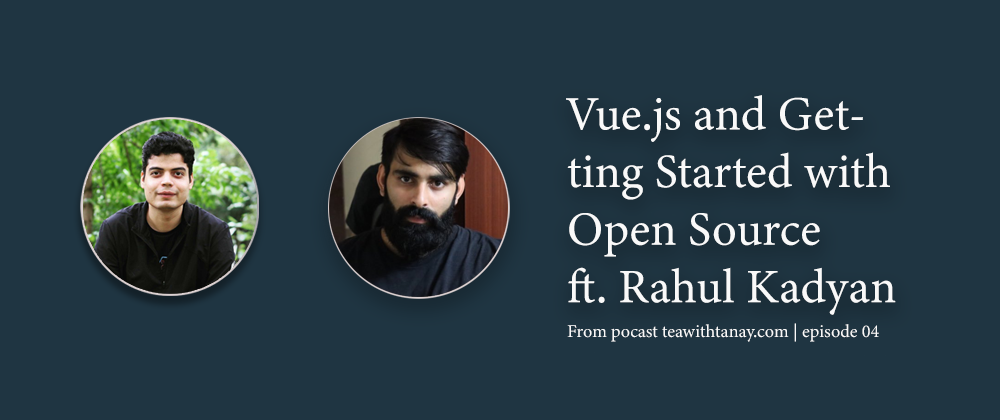

# Vuejs and Getting started with Open Source

Guest of this episode is [Rahul Kadyan](https://www.linkedin.com/in/rahulkadyan/), who is a senior software engineer at Myntra and a core contributor to Vue.js. He is also an organizer of [VueBLR](https://twitter.com/vueblr) meetup and [AwesomeConf](https://twitter.com/AnAwesomeConf) in Bangalore.

## *Tanay starts the podcast with a little introduction of Vue*
Vue is a progressive framework as it progresses with the scale of your application. It is adaptable, easy to pick up, integrate with other libraries or existing projects. It provides a view layer for building reactive applications. Vue’s gentle learning curve steals the hearts of beginners and advanced developers, making it more and more popular with time.

## *Why is Vue big in China?*
Vue originated in China. Since, the creator of Vue.js is Evan You, from China, Chinese tend to give more priority to their product rather than other frameworks backed up by tech giants like Google and Facebook. This makes Vue.js trending in the Chinese Market.  
Another reason could be the documentation in the Chinese language. It is written well and said to be the best among all the frameworks.

## *How you started with Open Source?*
Rahul tells that the Google Summer of Code program served as a stepping stone into the world of Open Source. It's a platform where students contribute to open-source projects and get paid. 
During that time at the GSOC program, Rahul worked on several projects on different technology.  
The strategy Rahul suggests is to check the error you are getting and try to debug around it. It enabled him to read code and learn from it.  
Earlier Rahul used to raise the issue if he finds something broken, then he started fixing it himself and sending PRs. The essential takeaway is to *fix the things which you are using.*

## *Why you should contribute to Open Source?*
Rahul sees open source as learning opportunities. You get to see different problems every day which could help you with your project as well. Reading code by other developers provides a different perspective to look at a problem. Their approach to solving an issue broadens your knowledge immensely.

## *How do you read code in a project?*
Open Source projects can be too overwhelming with too much information and it gets confusing sometimes to find a starting point. Rahul talks about two basic strategies that he follows:
Search for the error string you are getting and try to understand the code around it. If you are working with a tool, it's best suited to start solving errors you are facing.
The second approach could be finding the entry point of the program. Think like an interpreter, go line by line as the program is likely to run. This approach is helpful if you are exploring any project.

## *Does one need in-depth knowledge to contribute to a project?*
Rahul says that there is no limit to depth. The idea is to contribute to projects which you are learning currently. You should have a basic understanding of the syntax and you are good to go.

## *How to select an open-source project?*
You can use the GitHub search tool to search for labels such as beginners, good first issue, hacktoberfest, etc.  
[Hacktoberfest](https://hacktoberfest.digitalocean.com/) is a month-long celebration where you can get goodies for contributing to open-source. During October month, hundreds of projects get tagged with "hacktoberfest" label as beginner-friendly issues, this can be a good entry point.  
If you are stuck somewhere, you can discuss your problem with the comment thread GitHub provides on issues.

# *In open source, we feel strongly that to really do something well, you have to get a lot of people involved. -Linus Torvalds*