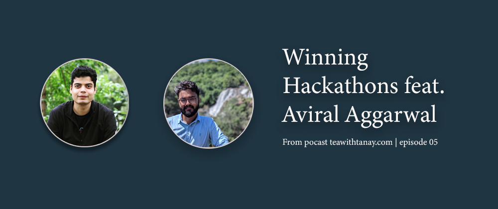

# Winning Hackathons feat. Aviral Aggarwal
  

[Listen to Winning Hackathons feat. Aviral Aggarwal | Episode 5 from Podcast: teawithtanay.com](https://teawithtanay.com/winning-hackathons-feat-aviral-aggarwal-episode-5/)   
In episode 5, [Aviral Aggarawal](https://www.linkedin.com/in/aviral190694/), iOS Developer at Microsoft joins Tanay to talk about how he got started with hackathons and why. Aviral calls himself a tech enthusiast who spends a lot of his time exploring tech, hackathons, and conferences. Tanay starts the conversation with his first question.

## *What's the story of your profile picture with Tim Cook?*
Aviral tells us that he has always been curious about Mac and wanted to get his hands on a Macbook in his office. He decided to learn iOS development and got a Macbook from his boss. He got to know about the Apple Worldwide Developers Conference (WWDC) and applied for free scholarship. Aviral started enrolling for WWDC in 2015 but got rejected for two consecutive years. Finally, he got selected to fly to the US in 2017 and luckily got a chance to meet Tim Cook.

> WWDC19 Scholarships reward talented students with the opportunity to attend Apple's annual Worldwide Developers Conference, and scholars also get a chance to meet Tim Cook.

Aviral talks about not getting selected three times out of his four attempts and how it helped him to grow in a person he is now. The takeaway is that *failures are also a part of the journey, and it nurtures you to grow in a better self*. It takes us to the next question of this podcast.

## *How do you deal with failures?*
Aviral talks about various techniques that he uses to get himself motivated.
He shares his goals with other people, it makes him accountable and creates a little pressure on him that he has to do what he said.
The second thing he does is he involves his parents and close friends. They serve as a source of motivation when you start having self-doubts after failure. They know your worth more than you do and will always cheer you up when you're feeling down.
The third piece of advice is to try a lot of stuff. Your chances of success increase with the number of involvement in multiple activities. If you succeed even in one out of ten things then this one success will help you overcome all the other failures.
Aviral was applying for WWDC, Google Summer of Code, and few other events at the same time to improve his chances of getting selected which takes us to our next question.

## *How do you get to know about these events?*
Aviral tells us that networking played an important role here. You should connect with like-minded people. They are usually active in sharing which events they went to or are going to attend.
Join groups like "[Hackathon Hackers](https://www.facebook.com/groups/759985267390294/)" where you can get information about ongoing events. Aviral spends a lot of time in these groups that help him find relevant information.

## *Can you tell us about your Alexa journey?*
Aviral tells us about his mentor, who bought him an Alexa device and asked him if he can build a skill for his company. He emphasizes the importance of working on one technology instead of trying out many at once, He says as he has already spent a couple of years in iOS development, so it was a perfect time to try something new. Aviral started investing more time in Alexa and looked at it as one of his side projects, which he always loves to work.  
After two months, he decided to go to a hackathon and build one skill onsite. It motivated him to build more skills and get a better understanding of how Alexa works.  
He then went on to win goodies and prize money by building skills for Alexa.

## *What is your Hackathon winning recipe?*
When Aviral started going to hackathons four years ago, his main intention was to be there and meet people. He wanted to understand where does he stands and what he needs to learn to get better. If you're a beginner, you should *concentrate more on attending and understanding how hackathons work*, Aviral says.
It usually serves as a booster for your projects where you work rapidly for two days and iterate over the project later.  
Aviral says that it's crucial to understand the purpose of the theme and why this hackathon is happening.  There are two types of hackathons in general:   
* If you are in a *"Presentation Hackathon"* then you should concentrate more on communicating your idea and your presentation skills.  
* If you are in a *"Technology Hackathon"* then what you've built matters more than how you present it.  

You should apply to hackathons where you think your idea fits.
Go with an idea planned in your mind and build the project there.
Talk to people and get feedback on how you can make that idea better.

## *How to choose among the various student programs?*
Apply in as many programs as you can and try to be in one. By applying, you will get an idea of how to submit applications to these programs and understand your weak points. It will enable you to compete on a global level.
Some of the programs are listed below:  
* Microsoft Student Partner
* Google Developer Expert
* Google Developer Student Group
* Google Summer of Code
* GirlScript Summer of Code
* Facebook Developer Circle
* Intel Software Ambassador Program
* Linkedin Writer Program
* Github Campus Ambassador Program

## *How did your freelance work start?*
Networking played a great role here. When you connect will lots of like-minded people, your chances of getting a good opportunity increases. Aviral got his freelancing gig when someone in his network approached him for help in a project. Freelancing polishes your skills and expands your knowledge base.

## *What's more important to focus during the hackathon?*
Aviral states some points to consider in this context:
Focus on the product and examine if the design or tech is going to help in that particular hackathon.  
A working prototype with one core feature is better than adding lots of features. So focus building one complete feature rather lots of addons.

## *How should a standard team look like?*
It depends on how many people you're comfortable with and you should team up with people who are also enthusiastic and interested in the event. ***A team is as good as the people in it***.
The end goal is to build something and be proud of it.

## *Are hackathons right for average coders?*
Aviral says that you should first understand the purpose of a hackathon. *It is to bring like-minded people under one roof and encourage them to build something together.* Attending these events and meeting people is more important than winning.   
The people you network with may also be coming from the same position as you're in and sitting beside them will influence your life and motivate you to level up.

## *"Don't let the fear of losing be greater than the excitement of winning." --Robert Kiyosaki*
